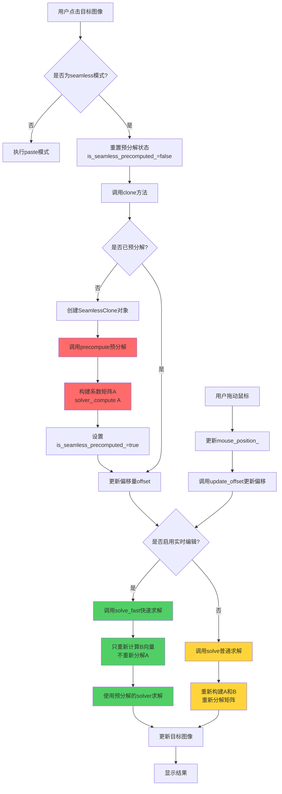

#### 记录实验成果

正常的seamless clone


##### 优化后的 混合梯度方案：


##### 自由绘制边框：


混合梯度：


#### 实时计算编译：




#### 混合梯度

##### 数学原理解析

根据 Perez 论文中的公式 (12) 和离散化公式 (13) ，对于中心像素 $p$ 和它的邻居 $q$：

- **源图像的梯度**：$grad\_g = g_p - g_q$

- 

  **目标图像的梯度**：$grad\_f = f^*_p - f^*_q$ 

混合梯度的引导向量场 $v_{pq}$ 定义为**两者中绝对值较大**的那个 ：

$$v_{pq} = \begin{cases} f^*_p - f^*_q & \text{if } |f^*_p - f^*_q| > |g_p - g_q| \\ g_p - g_q & \text{otherwise} \end{cases}$$

最后，泊松方程右侧的散度项就是四个方向 $v_{pq}$ 的和 ： $gradient\_rhs = v_{up} + v_{down} + v_{left} + v_{right}$


## 问题：

## 根本问题：mask索引计算错误

从[Image类](file:///f:\CG2026\homework in winter\USTC_CG_26\Framework2D\include\common\image.h)的定义可以看出：

- 图像数据布局是：`(y * width + x) * channels`
- mask图像也是4通道的（RGBA）

但在[seamless_clone.cpp](file:///f:\CG2026\homework in winter\USTC_CG_26\Framework2D\src\assignments\3_PoissonImageEditing\seamless_clone.cpp)中：


cpp


```
int mask_idx = y * W + x;  // ❌ 错误！没有乘以channels
if(src_selected_mask_->data()[mask_idx] == 0)
```

**问题**：mask索引计算错误，导致：

1. 没有正确跳过未选中区域
2. 所有像素都被包含在方程组中
3. 方程组求解错误，产生异常值

## 解决方案


seamless_clone.cpp


Apply

| `//填写 (x, y) 对应的方程系数 `                              |
| ------------------------------------------------------------ |
| `void SeamlessClone::fill_coefficient(int x,int y,int rgb_index){ ` |
| `    int idx = y * W + x; `                                  |
| `     `                                                      |
| `    int mask_idx = (y * W + x) * src_selected_mask_->channels(); ` |
| `    if(src_selected_mask_->data()[mask_idx] == 0){ `        |
| `        return; `                                           |
| `    } `                                                     |
| `     `                                                      |
| `    auto [gx, gy, gz] = g(x, y); `                          |
| `    auto [gx_up, gy_up, gz_up] = g(x, y - 1); `             |
| `    auto [gx_down, gy_down, gz_down] = g(x, y + 1); `       |
| `    auto [gx_left, gy_left, gz_left] = g(x - 1, y); `       |
| `            if(tar_x < 0 || tar_x >= tar_img_->width() || tar_y < 0 || tar_y >= tar_img_->height()){ ` |
| `                continue; `                                 |
| `            } `                                             |
| `             `                                              |
|                                                              |
|                                                              |
| `            int mask_idx = (y * W + x) * src_selected_mask_->channels(); ` |
| `            if(src_selected_mask_->data()[mask_idx] == 0){ ` |
| `                continue; `                                 |
| `            } `                                             |
| `             `                                              |

## 问题2

回退前，可以变白但是计算有问题：

```
//填写 (x, y) 对应的方程系数
void SeamlessClone::fill_coefficient(int x,int y,int rgb_index){
    int idx = y * W + x;
    
    int mask_idx = (y * W + x) * src_selected_mask_->channels();
    if(src_selected_mask_->data()[mask_idx] == 0){
        return;
    }
    
    auto [gx, gy, gz] = g(x, y);
    auto [gx_up, gy_up, gz_up] = g(x, y - 1);
    auto [gx_down, gy_down, gz_down] = g(x, y + 1);
    auto [gx_left, gy_left, gz_left] = g(x - 1, y);
            if(tar_x < 0 || tar_x >= tar_img_->width() || tar_y < 0 || tar_y >= tar_img_->height()){
                continue;
            }
            
            int mask_idx = (y * W + x) * src_selected_mask_->channels();
            if(src_selected_mask_->data()[mask_idx] == 0){
                continue;
            }
```

## 两个关键问题

1.g(x,y)图片映射错误：

原来写的是+ offset，会错误选取source的点；

```
std::tuple<double, double, double> SeamlessClone::g(int x, int y){
    // 内部处理，把(x,y)对应源图像的坐标：
    int src_x = x  + offset_x_;
    int src_y = y  + offset_y_;
```

2.系数矩阵构造存在问题：
之前以为边界的系数不是4，后来发现是恒定为4；（这导致nabla计算错误，爆掉，会纯白）

