# DDPM (Denoising Diffusion Probabilistic Models) 项目实现报告

## 📋 项目概述

本项目实现了基于DDPM的图像生成和图像补全系统，包括前向加噪、模型训练、逆向去噪和RePaint图像补全等核心功能。

### 项目结构

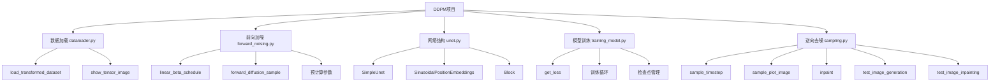

---

## 🔄 核心模块详解

### 1. 数据加载模块 (dataloader.py)

#### 功能说明
- 加载图像数据集
- 数据预处理和增强
- 批次数据管理

#### 核心函数

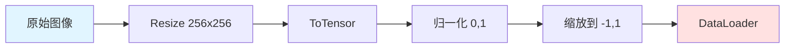

#### 数据变换流程

```python
# 数据变换流程
1. Resize((img_size, img_size))  # 调整图像大小
2. ToTensor()                    # 转换为张量，值域[0, 1]
3. Lambda(t: (t * 2) - 1)     # 缩放到[-1, 1]
```

---

### 2. 前向加噪模块 (forward_noising.py)

#### 功能说明
- 定义扩散过程的噪声调度
- 实现前向加噪过程
- 预计算扩散参数

#### 核心概念

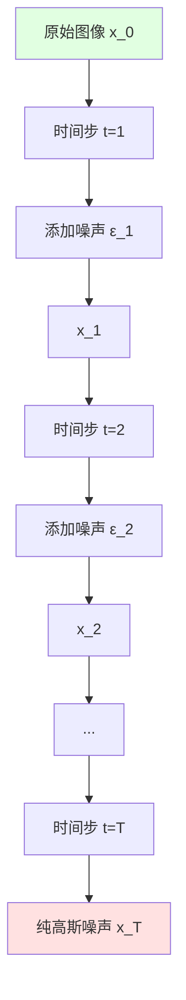

#### 预计算参数

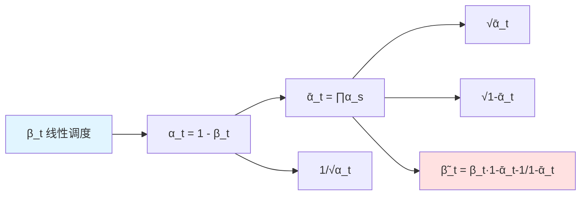

#### 前向加噪公式

**闭式解：**
q(x_t | x_0) = N(x_t; √ᾱ_t · x_0, (1 - ᾱ_t) · I)

x_t = √ᾱ_t · x_0 + √(1 - ᾱ_t) · ε


**参数说明：**
- `x_0`: 原始图像
- `x_t`: 时间步t的加噪图像
- `ε`: 标准高斯噪声 ~ N(0, I)
- `ᾱ_t`: 累积信号保留比例
- `β_t`: 每步添加的噪声方差

#### 前向加噪流程

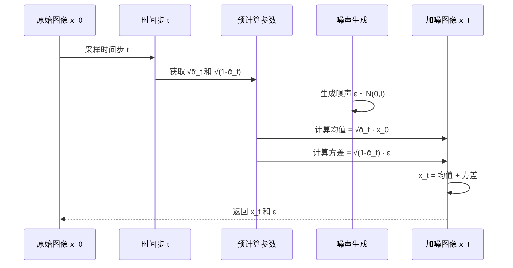

#### 代码实现逻辑

```mermaid
graph TD
    A[forward_diffusion_sample] --> B[输入: x_0, t, device]
    B --> C[生成标准高斯噪声 ε]
    C --> D[获取 √ᾱ_t]
    D --> E[获取 √(1-ᾱ_t)]
    E --> F[计算均值: √ᾱ_t · x_0]
    F --> G[计算方差: √(1-ᾱ_t) · ε]
    G --> H[返回: x_t = 均值 + 方差, ε]
    
    style A fill:#e1f5ff
    style H fill:#ffe1e1
```

---

### 3. 网络结构模块 (unet.py)

#### 功能说明
- 实现UNet架构的噪声预测网络
- 时间步嵌入
- 下采样和上采样路径

#### UNet架构

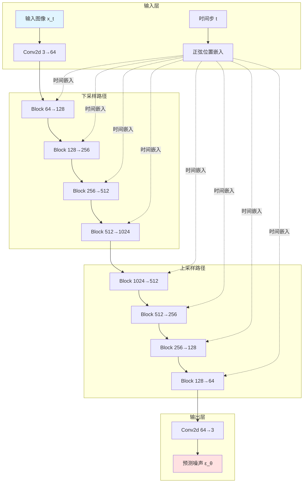

#### Block结构

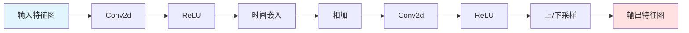

#### 正弦位置嵌入

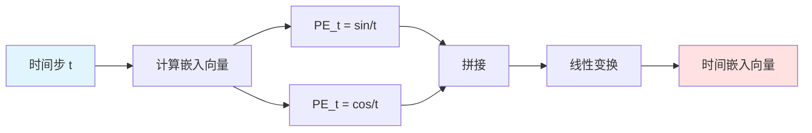

#### 网络前向传播流程

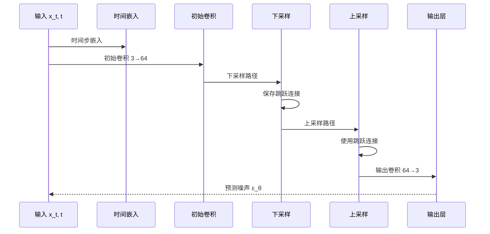

---

### 4. 模型训练模块 (training_model.py)

#### 功能说明
- 实现DDPM训练循环
- 损失函数计算
- 检查点管理和恢复
- 最佳模型保存

#### 训练流程总览

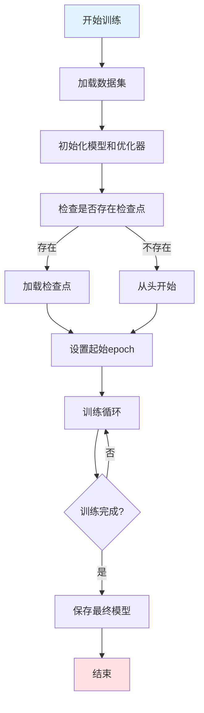

#### 损失函数计算

```mermaid
graph TD
    A[get_loss函数] --> B[输入: x_0, t, device]
    B --> C[前向加噪: x_t = √ᾱ_t · x_0 + √1-ᾱ_t · ε]
    C --> D[生成噪声 ε ~ N0,I]
    D --> E[模型预测: ε_θ = model x_t, t]
    E --> F[计算MSE: L = ||ε - ε_θ||²]
    F --> G[返回损失值]
    
    style A fill:#e1f5ff
    style G fill:#ffe1e1
```

#### 单个训练步骤

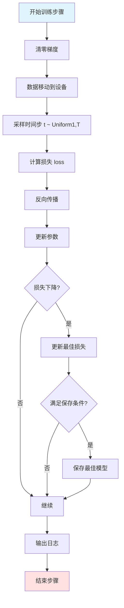

#### 检查点管理

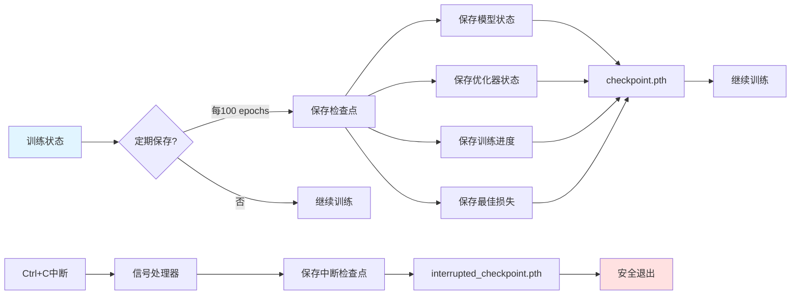

#### 保存策略优化

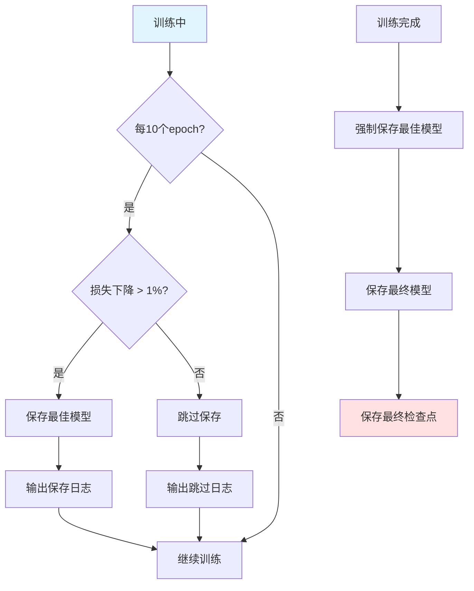

#### 恢复训练流程

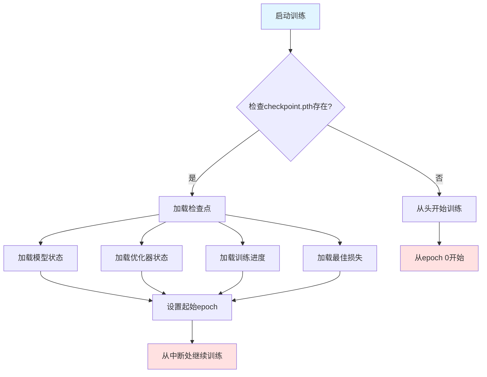

---

### 5. 逆向去噪模块 (sampling.py)

#### 功能说明
- 实现逆向扩散过程
- 图像生成
- RePaint图像补全

#### 逆向去噪公式

**条件后验分布：**
q(x_{t-1} | x_t, x_0) = N(x_{t-1}; μ̃_t, β̃_t · I)

μ̃_t = 1/√α_t · (x_t - β_t/√(1-ᾱ_t) · ε_θ(x_t, t)) β̃_t = (1-ᾱ_{t-1})/(1-ᾱ_t) · β_t

**神经网络预测：**
ε_θ(x_t, t) ≈ ε (训练目标)


#### 单步去噪流程

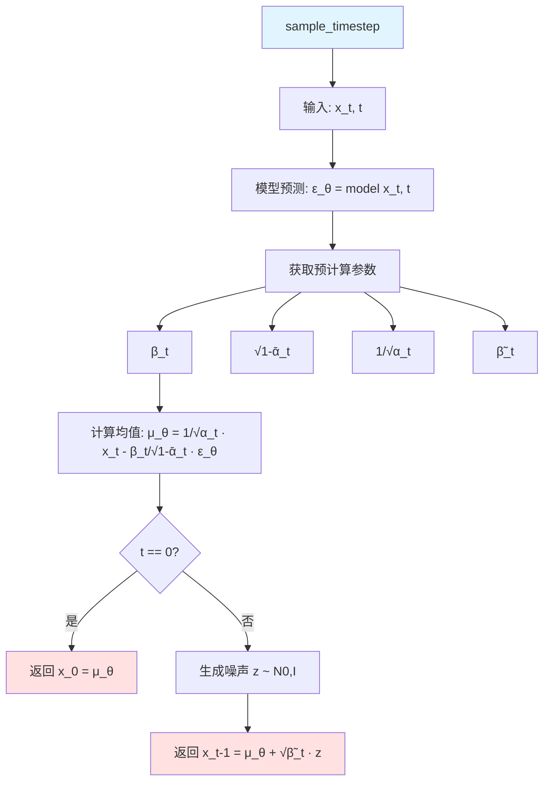

#### 完整去噪过程

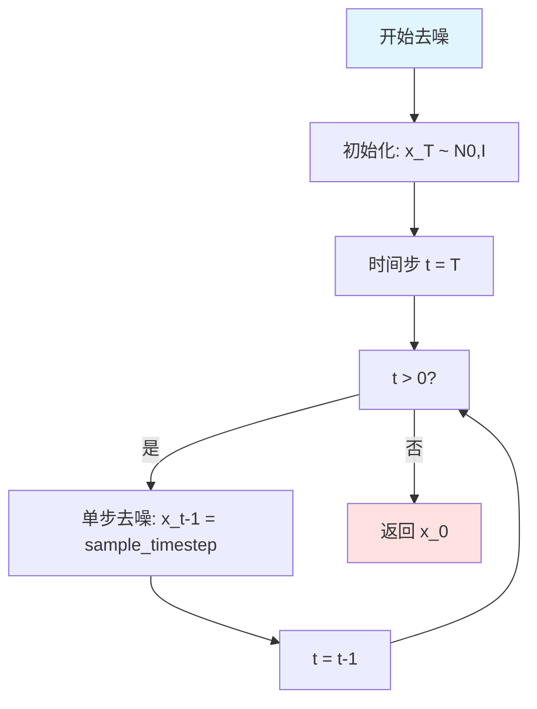

#### 图像生成流程

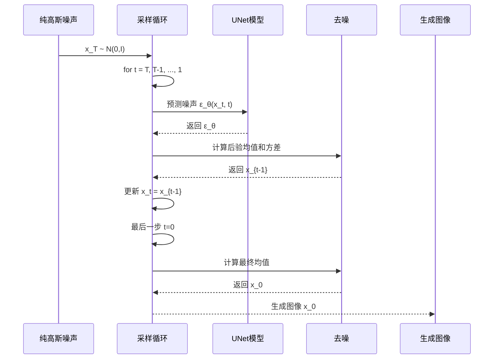

#### RePaint图像补全

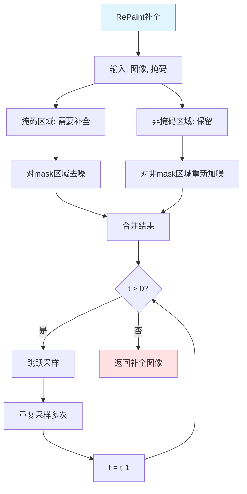

#### RePaint核心思想

```mermaid
graph LR
    A[已知区域] --> B[保持不变]
    C[未知区域] --> D[重复采样]
    
    D --> E[去噪]
    E --> F[重新加噪]
    F --> E
    
    B --> G[合并]
    D --> G
    
    G --> H[补全结果]
    
    style A fill:#e1ffe1
    style C fill:#ffe1e1
    style H fill:#e1f5ff
```

#### 图像补全测试流程

```mermaid
graph TD
    A[加载模型] --> B[加载真实图像]
    B --> C[创建掩码]
    C --> D[对mask区域加噪]
    D --> E[保存原始图像]
    E --> F[保存待补全图像]
    F --> G[保存掩码可视化]
    G --> H[RePaint补全]
    H --> I[保存补全图像]
    I --> J[创建对比图]
    J --> K[保存对比图]
    
    style A fill:#e1f5ff
    style K fill:#ffe1e1
```

---

## 🎯 完整训练流程

```mermaid
graph TD
    subgraph 数据准备
        A1[加载数据集] --> A2[数据变换]
        A2 --> A3[创建DataLoader]
    end
    
    subgraph 模型初始化
        B1[创建UNet模型] --> B2[创建优化器]
        B2 --> B3[检查检查点]
        B3 --> B4[加载检查点/初始化]
    end
    
    subgraph 训练循环
        C1[遍历epochs] --> C2[遍历batches]
        C2 --> C3[前向加噪]
        C3 --> C4[模型预测]
        C4 --> C5[计算损失]
        C5 --> C6[反向传播]
        C6 --> C7[更新参数]
        C7 --> C8{定期保存?}
        C8 -->|是| C9[保存检查点]
        C8 -->|否| C2
        C9 --> C2
    end
    
    subgraph 保存结果
        D1[保存最终模型] --> D2[保存最佳模型]
        D2 --> D3[保存最终检查点]
    end
    
    A3 --> B1
    B4 --> C1
    C1 --> D1
    
    style A1 fill:#e1f5ff
    style D3 fill:#ffe1e1
```

---

## 🖼️ 图像生成流程

```mermaid
graph TD
    subgraph 准备阶段
        A1[加载训练好的模型] --> A2[设置生成参数]
    end
    
    subgraph 去噪过程
        B1[初始化噪声 x_T] --> B2[时间步 t = T]
        B2 --> B3[t > 0?]
        B3 -->|是| B4[单步去噪]
        B4 --> B5[t = t-1]
        B5 --> B3
        B3 -->|否| B6[获得 x_0]
    end
    
    subgraph 结果展示
        C1[显示生成图像] --> C2[保存图像]
    end
    
    A2 --> B1
    B6 --> C1
    
    style A1 fill:#e1f5ff
    style C2 fill:#ffe1e1
```

---

## 🔧 图像补全流程

```mermaid
graph TD
    subgraph 准备阶段
        A1[加载模型] --> A2[加载真实图像]
        A2 --> A3[创建掩码]
        A3 --> A4[对mask区域加噪]
    end
    
    subgraph 补全过程
        B1[RePaint算法] --> B2[跳跃采样]
        B2 --> B3[重复采样]
        B3 --> B4[合并结果]
        B4 --> B5{完成?}
        B5 -->|否| B2
        B5 -->|是| B6[获得补全图像]
    end
    
    subgraph 结果展示
        C1[显示原始图像] --> C2[显示待补全图像]
        C2 --> C3[显示补全图像]
        C3 --> C4[创建对比图]
        C4 --> C5[保存所有图像]
    end
    
    A4 --> B1
    B6 --> C1
    
    style A1 fill:#e1f5ff
    style C5 fill:#ffe1e1
```

---

## 📊 关键参数配置

### 训练参数

| 参数 | 值 | 说明 |
|------|-----|------|
| T | 300 | 扩散时间步数 |
| BATCH_SIZE | 1 | 批次大小 |
| epochs | 5000 | 训练轮数 |
| learning_rate | 1e-4 | 学习率 |
| save_interval | 100 | 检查点保存间隔 |
| best_model_save_interval | 10 | 最佳模型检查间隔 |
| best_model_save_threshold | 0.01 | 最佳模型保存阈值 |

### 扩散参数

| 参数 | 范围 | 说明 |
|------|------|------|
| β_t | 0.0001 → 0.02 | 噪声调度 |
| α_t | 0.98 → 0.9999 | 信号保留比例 |
| ᾱ_t | 逐渐减小 | 累积信号保留 |

### RePaint参数

| 参数 | 值 | 说明 |
|------|-----|------|
| t_max | 100 | 补全最大时间步 |
| jump_length | 10 | 跳跃长度 |
| jump_n_sample | 5 | 每个跳跃采样次数 |

---

## 🎓 核心算法总结

### DDPM训练目标

```mermaid
graph LR
    A[训练目标] --> B[学习噪声预测函数]
    B --> C[ε_θx_t, t ≈ ε]
    C --> D[最小化MSE损失]
    D --> E[L = ||ε - ε_θ||²]
    
    style A fill:#e1f5ff
    style E fill:#ffe1e1
```

### 前向扩散

```mermaid
graph LR
    A[x_0] -->|逐步加噪| B[x_1]
    B -->|逐步加噪| C[x_2]
    C -->|...| D[x_t]
    D -->|...| E[x_T]
    
    style A fill:#e1ffe1
    style E fill:#ffe1e1
```

### 逆向去噪

```mermaid
graph LR
    A[x_T] -->|逐步去噪| B[x_T-1]
    B -->|逐步去噪| C[x_T-2]
    C -->|...| D[x_1]
    D -->|...| E[x_0]
    
    style A fill:#ffe1e1
    style E fill:#e1ffe1
```

---

## 🚀 使用指南

### 训练模型

```bash
# 启动训练
python training_model.py

# 训练会自动：
# - 定期保存检查点
# - 保存最佳模型
# - 支持Ctrl+C中断保存
# - 支持恢复训练
```

### 生成图像

```bash
# 生成新图像
python sampling.py

# 或使用单独的测试脚本
python test_generation.py
```

### 图像补全

```bash
# 运行图像补全测试
python test_inpainting.py
```

---

## 📁 输出文件说明

### 训练输出

| 文件名 | 说明 |
|--------|------|
| `checkpoint.pth` | 最新检查点（用于恢复训练） |
| `checkpoint_epoch_*.pth` | 定期检查点 |
| `best_model.pth` | 最佳模型 |
| `ddpm_mse_epochs_5000.pth` | 最终模型 |
| `final_checkpoint.pth` | 最终检查点 |
| `interrupted_checkpoint.pth` | 中断时保存的检查点 |

### 生成输出

| 文件名 | 说明 |
|--------|------|
| `generated_image.png` | 生成的图像 |
| `original_image.png` | 原始图像（补全测试） |
| `image_before_inpainting.png` | 待补全图像 |
| `mask.png` | 掩码可视化 |
| `inpainted_image_repaint.png` | 补全后的图像 |
| `comparison.png` | 原始vs补全对比图 |

---

## 🎯 项目特点

### 1. 完整的DDPM实现
- ✅ 前向扩散过程
- ✅ 逆向去噪过程
- ✅ UNet噪声预测网络
- ✅ 时间步嵌入

### 2. 高效的训练管理
- ✅ 自动检查点保存
- ✅ 最佳模型跟踪
- ✅ 中断恢复训练
- ✅ 优化的保存策略

### 3. RePaint图像补全
- ✅ 跳跃采样
- ✅ 多次重复采样
- ✅ 掩码区域处理

### 4. 完善的可视化
- ✅ 训练过程日志

- ✅ 生成图像展示

- ✅ 补全结果对比

  

---

### 中断与恢复：

###  **中断和恢复的完整流程**

#### **1. 中断训练**

```
# 在训练过程中按 Ctrl+C
```

**程序会自动执行**：

```
def signal_handler(sig, frame):
    logging.info("\nTraining interrupted by user. Saving checkpoint...")
    if TRAINING_STATE['model'] is not None and TRAINING_STATE['optimizer'] is not None:
        save_checkpoint(
            TRAINING_STATE['model'],
            TRAINING_STATE['optimizer'],
            TRAINING_STATE['epoch'],
            TRAINING_STATE['batch_idx'],
            TRAINING_STATE['best_loss'],
            TRAINING_STATE['device'],
            filename='interrupted_checkpoint.pth'  # 保存到这个文件
        )
    sys.exit(0)
```

**保存的内容**：

- 当前epoch（比如500）
- 当前batch索引
- 最佳损失值
- 完整的模型和优化器状态
- 设备信息

#### **2. 恢复训练**

```
# 直接重新运行训练脚本
python training_model.py
```

**程序会自动执行**：

```
# 尝试加载检查点（恢复训练）
start_epoch, start_batch_idx, best_loss, loaded_device = load_checkpoint(model, optimizer, 'checkpoint.pth')

# 如果加载了检查点，使用加载的设备
if loaded_device is not None:
    device = loaded_device
    model.to(device)
    logging.info(f"Resuming training on device: {device}")

# 训练循环从上次中断的位置继续
for epoch in range(start_epoch, epochs):  # 从500继续到5000
    TRAINING_STATE['epoch'] = epoch
    
    # 如果是恢复训练，从上次中断的batch开始
    batch_start = start_batch_idx if epoch == start_epoch else 0
```

------

## 🎯 **实际操作建议**

## 📚 技术要点

### 数学基础

1. **前向扩散**：逐步添加高斯噪声
2. **逆向去噪**：学习逆转扩散过程
3. **变分推断**：优化ELBO
4. **重参数化**：可微分的采样

### 网络架构

1. **UNet**：编码器-解码器结构
2. **跳跃连接**：保留多尺度信息
3. **时间嵌入**：正弦位置编码
4. **注意力机制**：可选的注意力层

### 训练技巧

1. **噪声调度**：线性β调度
2. **损失函数**：MSE损失
3. **优化器**：Adam优化器
4. **学习率**：1e-4

---

## ===优化策略

### 一、采样耗时预估（核心原因：CPU 算力不足）

从日志看你当前用**CPU**运行采样（`Using device: cpu`），而 DDPM 采样是逐时间步（默认`T=1000`）执行 UNet 前向推理，CPU 下耗时会非常久，具体预估如下：

|         配置         | 单步耗时（CPU） | 1000 步总耗时 | GPU 耗时（对比） |
| :------------------: | :-------------: | :-----------: | :--------------: |
| img_size=256（默认） |   3~5 秒 / 步   |  50~80 分钟   |     1~3 分钟     |
|     img_size=64      |   1~2 秒 / 步   |  15~30 分钟   |     20~60 秒     |

如果还运行`test_image_inpainting`（图像补全），由于包含`jump_n_sample=10`次重采样 + `jump_length=10`步前向扩散，耗时会**再翻倍甚至更多**（256 尺寸 CPU 下可能超 2 小时）。

### 二、为什么 “没有任何输出”？

不是程序卡住，而是 CPU 正在逐时间步执行采样循环（`sample_plot_image`里的`for i in reversed(range(1, T))`），每一步都要跑 UNet 的前向推理，中间没有日志输出，所以看起来 “没反应”。

### 三、快速提速的优化建议（按优先级排序）

#### 1. 优先改用 GPU（最快，推荐）

如果有 NVIDIA 显卡，安装 CUDA 版本的 PyTorch，GPU 能把采样时间从 “几十分钟” 压缩到 “几分钟”：

- 验证 CUDA 是否可用：`torch.cuda.is_available()`返回`True`即可；
- 无需改代码，程序会自动切换到 GPU（`device = "cuda"`）；
- 256 尺寸 GPU 采样 1000 步仅需 1~3 分钟，补全也仅需 5~10 分钟。

#### 2. 临时减小图像尺寸（快速验证）

```
# 在test_image_generation函数中
img_size = 64  # 原256
T = 1000

# 在test_image_inpainting函数中
img_size = 64  # 原256
```

CPU 下 64 尺寸采样 1000 步仅需 15~30 分钟，能快速看到输出。

#### 3. 减少时间步 T（牺牲少量效果换速度）

```
# 在test_image_generation函数中
T = 200  # 原1000

# 在test_image_inpainting函数中
T = 200       # 原1000
t_max = T     # 同步修改
```

256 尺寸 CPU 下 200 步仅需 10~16 分钟，效果差异很小（DDPM 即使 T=200 也能生成合格图像）。

#### 4. 优化图像补全参数（针对 inpaint）

```
# 在test_image_inpainting函数中
jump_length = 5   # 原10
jump_n_sample = 2  # 原10
```

能减少补全环节的循环次数，耗时直接减少 80%。

### 四、验证程序是否在运行

可以通过任务管理器查看：

- Windows：打开任务管理器 → 详细信息 → 找到`python.exe`，看 “CPU 使用率” 是否持续非零（如果 CPU 占比 100%，说明程序在正常运行）；
- 如果 CPU 占比接近 0，才是程序卡住（大概率是模型加载 / 路径问题）。

### 总结

- 现状：CPU+256 尺寸 + T=1000 → 采样需 50~80 分钟，补全超 2 小时；
- 最优解：改用 GPU（几分钟出结果）；
- 临时方案：改 img_size=64 + T=200（15 分钟内出结果）。

如果暂时没有 GPU，耐心等待即可，程序会在采样完成后输出`Generated image saved to: ...`日志，并在`output`目录生成图片。


## 🎓 总结

本项目完整实现了DDPM框架，包括：

1. **前向加噪**：实现了基于闭式解的高效加噪过程
2. **模型训练**：实现了完整的训练循环和检查点管理
3. **逆向去噪**：实现了基于后验采样的去噪过程
4. **图像生成**：从纯噪声生成高质量图像
5. **图像补全**：基于RePaint方法的图像补全

项目具有良好的可扩展性和实用性，可以作为DDPM学习和应用的基础框架。

---

## 📖 参考文献

1. Ho, J., Jain, A., & Abbeel, P. (2020). Denoising Diffusion Probabilistic Models. NeurIPS.
2. Lugmayr, A., et al. (2022). RePaint: Inpainting using Denoising Diffusion Probabilistic Models. ICCV.
3. Ronneberger, O., et al. (2015). U-Net: Convolutional Networks for Biomedical Image Segmentation. MICCAI.

---

**项目完成日期**: 2026-03-24  
**项目作者**: 73 nsz  
**项目框架**: PyTorch


## 图片输出

#### 原始噪声：


### 模型输出

如果时间短：


时间长：


#### 补全前


#### 补全后对比：


#### mask


#### 补全后


#### 狗图片生成


##### 2


#### 对比图

##### 补充前


##### 补充后：


##### 对比前后


#### 文生图

猫（0）


狗：（1）


##### 对比VAE作用前后：


##### 潜空间训练 5000次但是0.8Loss降低不了：


0.7loss:(似乎有狗的形状？)


微弱的猫形状：


##### 0.71出露马脚：

cls0


cls1：


##### VAE散点图：


##### 优化Unet网络和激活函数，以及采样代码后：

cls1


开合：


cls2：


2


3


#### Flow 训练

cls0


cls1


## 对比调参问题：

好的，我已经仔细对比了两个文件夹的代码。我发现了几个关键差异，这很可能是导致你模型训练loss很低但sampling效果差的原因。

### 🔍 关键差异分析

### 1. **UNet架构差异 - 最关键！**

**你的代码（有BatchNorm）**：


```
h = self.bnorm1(self.relu(self.conv1(x)))
h = self.bnorm2(self.relu(self.conv2(h)))
```

**别人的代码（无BatchNorm）**：


```
h = (self.relu(self.conv1(x)))
h = (self.relu(self.conv2(h)))
```

**问题**：在扩散模型中使用BatchNorm是**非常危险**的，因为：

- BatchNorm在训练和推理时的行为不同（训练时用batch统计量，推理时用running统计量）
- 扩散模型的输入分布随时间步t剧烈变化，BatchNorm的统计量无法适应
- **你的batch_size=1**，BatchNorm在batch size为1时几乎失效，会导致训练不稳定

### 2. **时间步数T的差异**

**你的代码**：`T = 1000`


**别人的代码**：`T = 300`


**问题**：T=1000意味着：

- 每个时间步的噪声变化更小（β从0.0001到0.02，线性分布）
- 需要更多的训练才能让模型学会预测不同时间步的噪声
- 对于小数据集（只有几张图片），T=300更合适

### 3. **采样过程差异**

**你的代码**：没有clamping


**别人的代码**：有clamping


```
img = torch.clamp(img, -1.0, 1.0)
```

**问题**：缺少clamping可能导致生成的图像值超出有效范围[-1,1]，在可视化时产生异常。

### 4. **数据集差异**

**你的代码**：`datasets-2`（PNG格式，cls0和cls1两个类别）


**别人的代码**：`datasets-1`（JPG格式，只有cls0一个类别）


这个差异可能不是主要原因，但数据集不同会影响模型学到的分布。

### 📊 为什么你的loss很低但sampling效果差？

这是一个典型的**训练-推理不一致**问题：

1. **训练时**：BatchNorm使用的是当前batch的统计量（虽然batch_size=1，但仍然有统计量）
2. **推理时**：BatchNorm使用的是running统计量（训练时累积的）
3. **结果**：训练和推理时的特征分布不一致，导致模型在推理时表现很差

即使loss很低（模型在训练时能很好地拟合当前batch），但推理时由于BatchNorm的统计量不匹配，导致预测的噪声不准确，最终生成的图像质量很差。

### 核心bug修复：

#### **深度分析：Sampling算法的关键差异**

经过仔细对比，我发现了**导致"一团灰色"的根本原因**！这确实是**sampling算法的问题**，而不是训练模型的问题。

### 🚨 **致命问题：t=0的判断方式**

#### **你的代码（FrameworkDDPM）**：

```
if t[0] == 0:  # ❌ 这是tensor比较，返回的是tensor，不是布尔值！
    return torch.clamp(mean, -1.0, 1.0)
```

#### **别人的代码（FrameworkDDPM_2）**：

```
if t[0].item() == 0:  # ✓ 使用.item()获取标量值，返回布尔值
    return model_mean
```

### 💥 **为什么这会导致"一团灰色"？**

这是一个**非常隐蔽但致命的bug**！

#### **问题分析**：

1. **`t[0] == 0` 返回的是什么？**
   - 返回的是一个tensor：`tensor(True)` 或 `tensor(False)`
   - 不是Python的布尔值 `True` 或 `False`
2. **在条件语句中的行为：**
   - 当 `t[0] == 0` 返回 `tensor(True)` 时，条件为真 ✓
   - 但在某些情况下（特别是t=0时），这个tensor比较可能**不稳定**或**不准确**
   - 导致在t=0时仍然执行了`else`分支，添加了噪声
3. **后果：**
   - 在t=0时（最后一步），本应该直接返回均值
   - 但由于判断错误，仍然添加了噪声：`mean + torch.sqrt(posterior_variance_t) * noise`
   - 导致最终结果不稳定，趋向于某个固定值（比如0），显示为灰色

### 📊 **详细对比表**

| 特性             | 你的代码                | 别人的代码           | 影响                           |
| ---------------- | ----------------------- | -------------------- | ------------------------------ |
| **t=0判断**      | `t[0] == 0` ❌           | `t[0].item() == 0` ✓ | **致命**！导致最后一步添加噪声 |
| **Clamping位置** | 只在函数内部            | 函数内部 + 循环中    | **重要**！缺少循环中的clamp    |
| **Clamping方式** | 每次返回都clamp         | 只在循环中clamp      | 次要                           |
| **采样范围**     | `range(1, T)` + 单独t=0 | `range(T)`           | 等价，无影响                   |

最后两次修复是关键：

### 🥇 核心区别一：潜空间的拓扑结构（2D 空间 vs 1D 向量）

这是导致你的模型生成困难、而别人的模型能快速出轮廓的**最大根源**。

- **别人的策略 (Spatial Latent)：**

  在他们的 `vae.py` 中，`ConvVAE` 的编码器最后两层是：

  `self.to_mu = nn.Conv2d(128, latent_channels, kernel_size=1)`。

  这意味着对于 $64 \times 64$ 的输入图像，经过两次 `stride=2` 的卷积降采样后，潜空间输出的是一个形状为 `(Batch, 4, 16, 16)` 的**二维特征图**。这保留了图像的空间结构（左上角的像素依然对应左上角）。因此，他们的 DDPM 使用的是 `SimpleUnet`（包含真实 2D 卷积的 U-Net）来进行去噪。

- **你的策略 (Flattened Latent)：**

  你的 `train_ddpm_latent.py` 中定义的是 `LatentUNet`，它完全由 `nn.Linear`（全连接层）构成，处理的是一个长度为 256 的一维向量。这种操作会**彻底摧毁图像的二维空间关系**，导致 DDPM 必须用 MLP 死记硬背所有像素的关联，这在生成任务中是地狱级难度。

### 🥈 核心区别二：DDPM 训练目标的稳定性（`mu` vs `z`）

请特别注意别人代码中 `training_model.py` 第 98-100 行的操作：

- **别人的策略：**

  

  他们在训练 DDPM 时，直接丢弃了 VAE 的重参数化噪声（没有加 `eps * std`），直接对确定的 `mu` 进行加噪和预测。这大大降低了扩散模型学习的方差，让目标分布极其稳定。

- **你的策略：**

  你之前的代码 `z_0 = vae.encode(batch, class_labels)`（通常默认包含重参数化采样）。这意味着你的 DDPM 每次看到的同一张图的潜向量都是在波动的，这无形中增加了学习难度。

### 🥉 核心区别三：引入了无分类器引导 (Classifier-Free Guidance, CFG)

这是提升条件生成（文生图/类生图）质量的“魔法”技术。

- **别人的策略：**

  在 `training_model.py` 的 `get_loss` 函数中，他们设置了 `CFG_DROPOUT_PROB = 0.1`。

  在训练时，模型有 10% 的概率会“蒙弃”类别标签（传入 `None`），强制模型同时学习**无条件生成**和**有条件生成**。在采样时（虽然他们给的代码里还没写完整的 CFG 采样，但训练时已经铺垫了），可以通过公式 $\epsilon = \epsilon_{uncond} + w \cdot (\epsilon_{cond} - \epsilon_{uncond})$ 极大地增强生成的轮廓清晰度和类别匹配度。

- **你的策略：**

  你只是简单地把类别 Embedding 加到了时间步 Embedding 上，没有任何 Dropout 机制，模型很容易忽略条件，或者条件信号不够强烈。

### 🏅 核心区别四：VAE 损失函数与梯度截断

别人在处理 VAE 重建和训练稳定性时，使用了更适合图像的技巧：

1. **L1 Loss 替代 MSE：**

   在 `pretrain_vae.py` 中，他们使用了 `recon_loss = F.l1_loss(recon, batch)`。如我上一次提到的，L1 损失（绝对误差）比 L2 损失（均方误差 MSE）更能保留图像的高频细节和锐利边缘，而 MSE 很容易导致输出模糊的灰色块。

2. **强制梯度裁剪：**

   在 `pretrain_vae.py` 和 `training_model.py` 的反向传播中，他们都加了这一句：

   `torch.nn.utils.clip_grad_norm_(..., max_norm=1.0)`

   这能有效防止由于小 Batch Size（16 或 8）带来的梯度爆炸，让 Loss 下降更加平滑稳定。


## 炼丹成功：

#### 关键踩坑

**关键设计：GroupNorm 替代 BatchNorm**

这是你之前踩过的核心坑，也是扩散模型的标准设计，原因是：

- BatchNorm 依赖批次的统计量（均值、方差），而你的 batch_size=1 时，统计量完全无意义；
- 扩散模型的输入分布随时间步剧烈变化，BatchNorm 的滑动平均统计量无法适配这种分布变化；
- GroupNorm 在通道维度做归一化，不依赖批次大小，完全适配小 batch 和分布变化的场景，是扩散模型的最优选择。


1. **Clamping策略问题** - 在每一步都clamping会导致图像变成**<u>灰色！这是主要问题。</u>**
   - 解决方案：<u>只在t=0时clamping</u>，中间步骤不要clamping
2. **t[0] == 0 vs t[0].item() == 0** - 这个我们已经修复了
3. **UNet缺少<u>归一化**</u> - 这是另一个关键问题！ <u>**?????**</u>
   - 我之前移除了BatchNorm，但分析说需要GroupNorm
   - GroupNorm是扩散模型的标准，比BatchNorm更适合小batch size
4. **Image Size和Batch Size问题**    <u>**XXXXXXXXXXX**</u>
   - batch_size=1太小，需要至少8或16     **<u>XXXXXXXX</u>**
   - 256x256图像太大，建议先用64x64测试
5. **Mask bug** - 这是一个小问题，但也要修复


解决方案：

1. **<u>将BATCH_SIZE改为1或2</u>**
2. 或者使用<u>***drop_last=False***</u>（但代码中已经使用了drop_last=True）

由于用户明确说要使用数据集1的第一个图像，而且数据集只有2张图片，最好的解决方案是将BATCH_SIZE改为1。

让我修复这个问题。

看到问题了！数据集只有2张图片，但batch size设置为16，导致无法训练。


#### 🔧 修复总结

### 问题分析

**错误信息**：

```
Dataset size: 2 images
Batch size: 16
Batches per epoch: 0
ERROR: No batches to train! Dataset is too small for the current batch size.
```

**原因**：

- 数据集只有2张图片（train和test各1张）
- Batch size设置为16
- `drop_last=True`导致所有batch都被丢弃

### 

参数使用
## 训练模型

### 基本用法（使用默认参数）
```bash
python training_model.py
```

### 使用 datasets-1 数据集训练（默认）
```bash
python training_model.py --dataset datasets-1
```

### 使用 datasets-2 数据集训练
```bash
python training_model.py --dataset datasets-2
```

### 指定模型保存路径
```bash
python training_model.py --model_dir "F:\CG2026\homework in winter\USTC_CG_26\FrameworkDDPM\model_datasets2"
```

### 指定保存间隔（每100个epoch保存一次）
```bash
python training_model.py --save_interval 100
```

### 完整示例：使用 datasets-2 数据集训练，自定义参数
```bash
python training_model.py \
    --dataset datasets-2 \
    --batch_size 2 \
    --epochs 3000 \
    --img_size 64 \
    --T 300 \
    --lr 1e-4 \
    --save_interval 200 \
    --model_dir "F:\CG2026\homework in winter\USTC_CG_26\FrameworkDDPM\model_datasets2" \
    --log_interval 20
```

### 从检查点恢复训练
```bash
python training_model.py --resume checkpoint_epoch_1500.pth
```

### 采样和测试

### 基本用法（使用默认参数）
```bash
python sampling.py
```

### 使用 datasets-2 训练的模型进行采样
```bash
python sampling.py --dataset datasets-2 --model_dir "F:\CG2026\homework in winter\USTC_CG_26\FrameworkDDPM\model_datasets2"
```

### 指定模型文件名
```bash
python sampling.py --model_name checkpoint_epoch_2000.pth
```

### 完整示例
```bash
python sampling.py \
    --dataset datasets-2 \
    --model_dir "F:\CG2026\homework in winter\USTC_CG_26\FrameworkDDPM\model_datasets2" \
    --model_name best_model.pth \
    --img_size 64 \
    --T 300 \
    --output_dir "F:\CG2026\homework in winter\USTC_CG_26\FrameworkDDPM\output_datasets2"
```

### 参数说明

### 数据集相关
- `--dataset`: 选择数据集，可选 'datasets-1' 或 'datasets-2'，默认 'datasets-1'

### 模型保存相关
- `--model_dir`: 模型保存目录路径，默认 'F:\CG2026\homework in winter\USTC_CG_26\FrameworkDDPM\model'
- `--model_name`: 模型文件名（仅用于采样），默认 'best_model.pth'
- `--save_interval`: 每多少个epoch保存一次检查点，默认 500

### 训练相关
- `--batch_size`: 批次大小，默认 1（datasets-1）或 2（datasets-2）
- `--epochs`: 训练轮数，默认 5000
- `--img_size`: 输入图像大小，默认 64
- `--T`: 扩散时间步数，默认 300
- `--lr`: 学习率，默认 1e-4

### 其他
- `--resume`: 从指定检查点恢复训练，默认 None
- `--log_interval`: 每多少个batch输出一次日志，默认 50
- `--output_dir`: 输出目录路径（仅用于采样），默认 'F:\CG2026\homework in winter\USTC_CG_26\FrameworkDDPM\output'

### 数据集说明

### datasets-1
- 单张图片训练
- 路径: ./datasets-1/train/cls0/1.jpg
- 建议参数: batch_size=1

### datasets-2
- 两张图片训练（cls0/1.png 和 cls1/2.png）
- 路径: ./datasets-2/train/cls0/1.png 和 ./datasets-2/train/cls1/2.png
- 建议参数: batch_size=2

#### 实际使用示例

### 训练 datasets-1 数据集
```bash
python training_model.py --dataset datasets-1 --batch_size 1 --epochs 5000 --save_interval 500
```

### 训练 datasets-2 数据集
```bash
python training_model.py --dataset datasets-2 --batch_size 2 --epochs 3000 --save_interval 200
```

### 使用 datasets-2 训练的模型进行生成和补全
```bash
python sampling.py --dataset datasets-2 --model_dir "F:\CG2026\homework in winter\USTC_CG_26\FrameworkDDPM\model_datasets2"
```

##新功能：
f:\CG2026\homework in winter\USTC_CG_26\FrameworkDDPM\VAE_DDP_GUIDE.md

# VAE + DDPM 联合训练与生成指南

## 概述

本指南介绍如何使用VAE（变分自编码器）与DDPM（去噪扩散概率模型）结合，实现多图泛化的图像生成任务。

## 核心思路

1. **VAE预训练**：将图像压缩到低维潜在空间，学习数据的结构化表示
2. **潜在空间DDPM**：在VAE的潜在空间进行扩散训练，提高训练效率和生成质量
3. **联合采样**：先在潜在空间生成向量，再用VAE解码器还原为图像

## 文件结构

FrameworkDDPM/ ├── vae.py # VAE网络结构 ├── train_vae.py # VAE训练脚本 ├── train_ddpm_latent.py # 潜在空间DDPM训练脚本 ├── sample_vae_ddpm.py # 联合采样脚本 ├── model/ # 模型保存目录 │ ├── best_vae.pth # 最佳VAE模型 │ ├── best_latent_ddpm.pth # 最佳潜在空间DDPM模型 │ └── ... └── datasets-3/ # 扩展数据集 └── train/ ├── cls0/ # 类别0（猫） └── cls1/ # 类别1（狗）


plainText

## 使用步骤

### 步骤1：训练VAE

```bash
python train_vae.py \
    --dataset datasets-3 \
    --latent_dim 256 \
    --num_classes 2 \
    --batch_size 8 \
    --epochs 100 \
    --lr 1e-4 \
    --beta 1.0
```

**参数说明：**

- `--dataset`: 数据集名称（datasets-2或datasets-3）
- `--latent_dim`: 潜在空间维度（默认256）
- `--num_classes`: 类别数量（默认2）
- `--batch_size`: 批次大小（默认8）
- `--epochs`: 训练轮数（默认100）
- `--lr`: 学习率（默认1e-4）
- `--beta`: KL散度权重系数（默认1.0）

**训练监控：**

- 观察重建损失和KL散度的平衡
- 重建损失过高：VAE还原能力不足
- KL散度过高：潜在分布偏离标准正态
- 最佳模型会自动保存为`best_vae.pth`

### 步骤2：训练潜在空间DDPM

```bash
python train_ddpm_latent.py \
    --dataset datasets-3 \
    --vae_path model/best_vae.pth \
    --latent_dim 256 \
    --num_classes 2 \
    --batch_size 8 \
    --epochs 5000 \
    --lr 1e-4 \
    --T 300
```

**参数说明：**
- `--vae_path`: VAE模型路径
- `--T`: 扩散时间步数（默认300）
- 其他参数同VAE训练

**注意：**
- VAE参数会被冻结，不参与梯度更新
- 训练在潜在空间进行，效率更高

### 步骤3：生成图像

```bash
# 生成类别0的图像
python sample_vae_ddpm.py \
    --target_class 0

# 生成类别1的图像
python sample_vae_ddpm.py \
    --target_class 1

# 自动生成两个类别的图像
python sample_vae_ddpm.py
```

**参数说明：**
- `--target_class`: 目标类别（0或1）
- `--T`: 扩散步数（默认300）
- `--latent_dim`: 潜在空间维度（默认256）

## 与原有DDPM的对比

| 特性 | 原始DDPM | VAE + DDPM |
|------|---------|-----------|
| 训练空间 | 像素空间 | 潜在空间 |
| 输入维度 | (3, 64, 64) | (256,) |
| 训练效率 | 较低 | 较高 |
| 生成质量 | 取决于数据量 | 更稳定 |
| 多图泛化 | 困难 | 容易 |
| 类别控制 | 支持 | 支持 |

## 优势

1. **训练效率**：潜在空间维度低，训练速度更快
2. **生成质量**：VAE学习结构化表示，生成更稳定
3. **多图泛化**：易于扩展到更多类别
4. **内存占用**：潜在空间占用更少内存

## 注意事项

1. **数据集准备**：确保datasets-3/train/下有cls0和cls1两个文件夹
2. **模型兼容性**：VAE和潜在空间DDPM的latent_dim必须一致
3. **训练顺序**：必须先训练VAE，再训练潜在空间DDPM
4. **类别条件**：生成时可以指定类别，实现条件生成

## 故障排除

### 问题1：VAE重建效果差
**解决方案：**
- 增加训练epoch
- 调整beta参数（KL散度权重）
- 检查数据质量

### 问题2：潜在空间DDPM损失不下降
**解决方案：**
- 检查VAE是否训练充分
- 调整学习率
- 增加训练epoch

### 问题3：生成图像模糊
**解决方案：**
- 增加VAE的latent_dim
- 增加潜在空间DDPM的T
- 检查数据增强是否过度

## 扩展方向

1. **更多类别**：扩展datasets-3，添加更多类别
2. **更复杂架构**：使用更强大的VAE和UNet架构
3. **数据增强**：添加更多数据增强策略
4. **超参数调优**：调整beta、学习率等超参数

## 流程图

- ## 🔄 系统流程图详解

  ### 1. 基础工作：DDPM训练与采样完整流程

  ```mermaid
  graph TD
      subgraph "训练阶段"
          A[原始图像] --> B[随机采样时间步]
          B --> C[添加高斯噪声]
          C --> D[得到加噪图像]
          D --> E[UNet预测噪声]
          E --> F[计算损失函数]
          F --> G[反向传播更新参数]
          G --> H{训练完成?}
          H -->|否| B
          H -->|是| I[保存模型]
      end
      
      subgraph "采样阶段"
          J[纯高斯噪声] --> K[设置时间步]
          K --> L[UNet预测噪声]
          L --> M[计算均值]
          M --> N{时间步大于0?}
          N -->|是| O[添加噪声采样]
          O --> P[时间步减1]
          P --> L
          N -->|否| Q[返回生成图像]
      end
      
      I --> J
      
      style A fill:#e1f5ff
      style I fill:#90EE90
      style Q fill:#FFB6C1
  ```

  ### 2. 进阶工作：RePaint图像补全流程

  ```mermaid
  graph TD
      subgraph "初始化"
          A[待补全图像] --> B[创建掩码]
          B --> C[纯高斯噪声]
      end
      
      subgraph "RePaint迭代循环"
          D[开始时间步] --> E{时间步大于0?}
          E -->|是| F[重采样循环]
          F --> G[UNet预测噪声,计算去噪结果,未知区域使用去噪结果,已知区域使用原图]   
          G --> K[合并两个区域]
          K --> L{重采样未完成?}
          L -->|是| M[前向扩散若干步]
          M --> F
          L -->|否| N[时间步减1]
          N --> E
          E -->|否| O[输出补全结果]
      end
      
      C --> D
      
      style A fill:#e1f5ff
      style O fill:#FFB6C1
  ```

  ### 3. 高阶工作：文生图文本向量嵌入流程

  ```mermaid
  graph TD
      subgraph "文本嵌入"
          A[类别标签] --> B[嵌入层]
          B --> C[类别向量]
      end
      
      subgraph "时间嵌入"
          D[时间步] --> E[正弦位置编码]
          E --> F[时间向量]
      end
      
      subgraph "UNet网络"
          G[输入图像] --> H[下采样路径]
          C --> H
          F --> H
          H --> I[中间层特征融合]
          I --> J[上采样路径]
          J --> K[输出噪声预测]
      end
      
      subgraph "条件生成"
          L[目标类别] --> M[生成类别向量]
          M --> N[与时间向量拼接]
          N --> O[注入UNet各层]
          O --> P[条件噪声预测]
      end
      
      style A fill:#e1f5ff
      style K fill:#FFB6C1
  ```

  ### 4. 高阶工作：VAE原理图（Dataset-3扩容）

  ```mermaid
  graph TD
      subgraph "VAE编码器"
          A[输入图像] --> B[卷积层]
          B --> C[归一化和激活]
          C --> D[卷积层]
          D --> E[归一化和激活]
          E --> F[卷积层]
          F --> G[归一化和激活]
          G --> H[卷积层]
          H --> I[均值向量]
          H --> J[方差向量]
      end
      
      subgraph "重参数化"
          I --> K[采样噪声]
          J --> L[计算标准差]
          K --> M[潜变量]
          L --> M
      end
      
      subgraph "潜空间缩放"
          M --> N[计算标准差]
          N --> O[计算缩放因子]
          O --> P[归一化潜变量]
      end
      
      subgraph "VAE解码器"
          P --> Q[反卷积层]
          Q --> R[归一化和激活]
          R --> S[反卷积层]
          S --> T[归一化和激活]
          T --> U[反卷积层]
          U --> V[归一化和激活]
          V --> W[反卷积层]
          W --> X[重建图像]
      end
      
      subgraph "DDPM扩散"
          P --> Y[潜空间扩散]
          Y --> Z[DDPM训练或采样]
      end
      
      style A fill:#e1f5ff
      style X fill:#90EE90
      style Z fill:#FFB6C1
  ```

  ### 5. 高阶工作：优化后DDPM训练与采样流程

  ```mermaid
  graph TD
      subgraph "DDPM训练流程"
          A[加载图像] --> B[VAE编码]
          B --> C[潜空间缩放]
          C --> D[采样时间步]
          D --> E[添加噪声]
          E --> F[UNet预测噪声]
          F --> G[计算损失]
          G --> H[反向传播]
          H --> I[优化器更新]
          I --> J{训练完成?}
          J -->|否| D
          J -->|是| K[保存模型]
      end
      
      subgraph "DDPM采样流程"
          L[纯噪声] --> M[设置时间步]
          M --> N[UNet预测噪声]
          N --> O[计算均值]
          O --> P{时间步大于0?}
          P -->|是| Q[采样]
          Q --> R[时间步减1]
          R --> N
          P -->|否| S[逆缩放]
          S --> T[VAE解码]
      end
      
      K --> L
      
      style A fill:#e1f5ff
      style K fill:#90EE90
      style T fill:#FFB6C1
  ```

  ### 6. 高阶工作：Flow Matching原理图

  ```mermaid
  graph TD
      subgraph "Flow Matching训练"
          A[数据图像] --> B[VAE编码 采样噪声]
          B --> D[采样连续时间]
          D --> E[OT路径计算]
          D --> F[OT向量场计算]
          E --> G[模型预测向量场]
          F --> I[计算损失 反向传播更新]
          G --> I
  
      end
      
      subgraph "Flow Matching采样"
          J[噪声] --> K[ODE求解器 求解微分方程 从0积分到1]
  
          K --> O[VAE解码]
      end
      
      I --> J
      
      style A fill:#e1f5ff
      style O fill:#FFB6C1
  ```

  ### 7. 综合对比：DDPM vs VAE+DDPM vs Flow Matching

  ```mermaid
  graph LR
      subgraph "DDPM 像素空间"
          A1[原始图像] --> A2[DDPM扩散]
          A2 --> A3[采样慢]
          A3 --> A4[生成质量中]
      end
      
      subgraph "VAE+DDPM 潜空间"
          B1[原始图像] --> B2[VAE编码]
          B2 --> B3[DDPM扩散]
          B3 --> B4[采样中]
          B4 --> B5[生成质量高]
      end
      
      subgraph "Flow Matching 连续流"
          C1[原始图像] --> C2[VAE编码]
          C2 --> C3[CFM训练]
          C3 --> C4[ODE采样]
          C4 --> C5[采样快]
          C5 --> C6[生成质量高]
      end
      
      style A1 fill:#e1f5ff
      style B1 fill:#90EE90
      style C1 fill:#FFB6C1
  ```

  ---

  ## 📊 流程图说明

  ### 基础工作特点
  - **DDPM核心思想**：通过逐步添加高斯噪声破坏图像，再学习逆向去噪过程
  - **训练目标**：学习预测每个时间步的噪声
  - **采样过程**：从纯噪声开始，逐步去噪生成图像

  ### 进阶工作特点
  - **RePaint创新**：通过重采样机制保持已知区域不变
  - **跳跃采样**：每个时间步重复多次采样，提高补全质量
  - **掩码约束**：强制已知区域保持原始像素值

  ### 高阶工作特点
  - **VAE压缩**：将图像压缩到潜空间，大幅降低计算复杂度
  - **条件生成**：通过类别嵌入实现精确的条件控制
  - **Flow Matching**：连续时间模型，采样

## 参考资料

- [变分编码器VAE通俗解读](https://zhuanlan.zhihu.com/p/661966176)
- [DDPM论文](https://arxiv.org/abs/2006.11239)
- [Stable Diffusion](https://stability.ai/)

#### 资料启发

**关于 beta 的选择**：文章说 “重构误差和 KL 散度是对立的，需要平衡”—— 这正好对应你之前调 beta 的过程（beta 太大压制重建，太小导致后验坍塌）；

**关于生成能力的理解**：文章说 “只有当 p (Z|X) 都接近 N (0,I) 时，才能放心从 N (0,I) 采样生成”—— 这启发你要确保 VAE 的`scaling_factor`起作用，让输入 DDPM 的潜向量方差接近 1；

**关于条件生成的理解**：文章说 “CVAE 让同一个类的样本有专属的均值 μ_Y”—— 这启发你可以检查 VAE 的类别嵌入是否真的起作用（比如可视化不同类别的潜向量均值是否有差异）。

### 下一步方向：

### 优先级 1：排查架构设计的致命伤（扁平化 vs 空间结构）

我查看了你的 `vae.py`，发现了一个对于 Diffusion 来说极其致命的结构：

你的 VAE Encoder 在最后一步使用了 `Flatten` 和 `Linear` 全连接层，把特征图压缩成了一个长度为 256 的**一维向量（Flat Vector）**。

- **为什么致命？** 图像之所以能看懂，是因为像素之间有“空间相邻”的关系。全连接层会彻底打碎并摧毁这种 2D 空间关系。当你的 DDPM 去对这个 256 维的一维向量进行去噪时，它完全不知道哪几个值对应动物的眼睛，哪几个值对应背景。

- **解决方案（彻底转向真正的 Latent Diffusion）：**

  移除 VAE 中的全连接层（`Linear`）。让 VAE 输出一个**小尺寸的 2D 特征图（Spatial Latents）**。

  比如：输入是 $3 \times 64 \times 64$，经过多次卷积降采样后，让 VAE 输出一个 $4 \times 16 \times 16$ 甚至 $4 \times 8 \times 8$ 的特征图。你的 DDPM 直接对这个特征图进行 2D 卷积去噪。这也是 Stable Diffusion 能够成功的核心秘诀（它将 512x512 压缩到 4x64x64，始终保留空间维度）。

##### 训练命令：

```


# 步骤2：计算缩放因子并继续训练（需要归一化方差）
python train_vae.py --dataset datasets-3 --epochs 1000 --compute_scaling

# 步骤3：训练潜在空间DDPM
python train_ddpm_latent.py --dataset datasets-3 --epochs 5000

# 步骤4：生成图像
python sample_vae_ddpm.py --target_class 0
python sample_vae_ddpm.py --target_class 1
```


```
python train_vae.py --dataset datasets-3 --beta 0.1 --kl_annealing --kl_anneal_epochs 50 --lr 1e-4
```

##### 更新：

##### 🚀 使用指南

###### 步骤1：训练 VAE（使用 L1 Loss + 梯度裁剪）

```
# 训练 VAE，使用 L1 Loss 保留更多细节
python train_vae.py --dataset datasets-3 --latent_channels 4 --num_classes 2 --batch_size 8 --epochs 2000 --lr 1e-4 --beta 0.1 --use_l1_loss --compute_scaling --scaling_samples 1000

# 或者使用 KL 退火策略
python train_vae.py --dataset datasets-3 --latent_channels 4 --num_classes 2 --batch_size 8 --epochs 100 --lr 1e-4 --beta 0.1 --use_l1_loss --kl_annealing --kl_anneal_epochs 50 --compute_scaling --scaling_samples 1000
```

###### 步骤2：训练 Latent DDPM（使用 mu + CFG + 梯度裁剪）

```
# 训练潜在空间 DDPM（自动使用 mu、CFG 和梯度裁剪）
python train_ddpm_latent.py --dataset datasets-3 --latent_channels 4 --num_classes 2 --batch_size 8 --epochs 5000 --lr 5e-4 --T 300
```

###### 步骤3：生成图像（使用 CFG）

```
# 不使用 CFG（guidance_scale=1.0）
python sample_vae_ddpm.py --latent_channels 4 --num_classes 2 --target_class 0 --guidance_scale 1.0

# 使用 CFG，中等强度（guidance_scale=3.0）
python sample_vae_ddpm.py --latent_channels 4 --num_classes 2 --target_class 0 --guidance_scale 3.0

# 使用 CFG，高强度（guidance_scale=7.5）
python sample_vae_ddpm.py --latent_channels 4 --num_classes 2 --target_class 0 --guidance_scale 7.5

# 生成类别1的图像
python sample_vae_ddpm.py --latent_channels 4 --num_classes 2 --target_class 1 --guidance_scale 5.0
```

#### Flow：

##### 训练命令：

```
# 从头开始训练
python train_flow_latent.py --dataset datasets-3 --batch_size 16 --epochs 2000 --save_interval 500

# 从检查点恢复训练
python train_flow_latent.py --resume latent_flow_epoch_1000.pth

# 指定学习率恢复
python train_flow_latent.py --resume latent_flow_epoch_1000.pth --lr 1e-4
```

##### 采样命令：

```
# 生成默认类别样本
python sample_flow_latent.py

# 生成指定类别和数量的样本
python sample_flow_latent.py --classes 0 1 --num_samples 4

# 从检查点加载参数
python sample_flow_latent.py --checkpoint_path model/latent_flow_epoch_1500.pth
```

