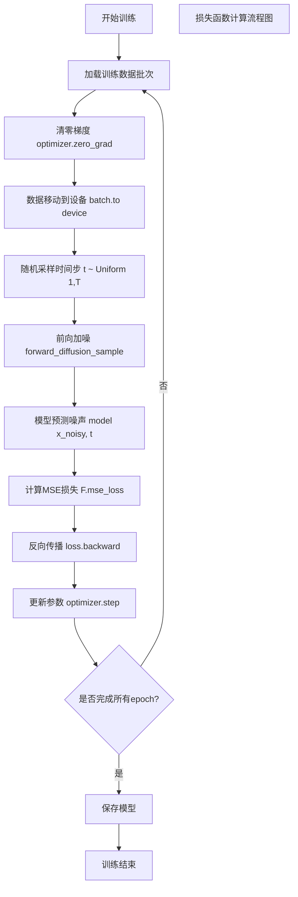

醉梦似笙情
 Workspace

结合配置说明，我需要创建虚拟环境吗？

现有版本哪个合适完成本任务：

Python 3.12.6 c:\python312\python.exe

Python 3.12.6 c:\python312\python.exe

Python 3.12 (64-bit)C:\Python312\python.exe

Python 3.8 (64-bit)C:\Users\\AppData\Local\Programs\Python\Python38\python.exe

base (3.12.7)E:\Anacorra

logic (3.12.7)E:\Anacorra\envs\logic

image_mosaic (3.10.19)E:\Anacorral\envs\image_mosaic

sensevoice (3.10.19)E:\Anacorra\envs\sensevoice

rl_env (3.10.16)E:\Anacorra\envs\rl_env

gluon (3.6.13)E:\Anacorra\envs\gluon

检查需求txt，我现有

DDPM作业说明

作业框架

框架结构

作业框架内结构如下：

FrameworkDDPM

datasets-*: 我们提供的数据集。其中1为单图单类别，2为双图双类别。如果你需要使用自己的数据集，请使用与我们提供的数据集相同的格式，或者参考torchvision.datasets.ImageFolder官方文档进行创建。

requirements.txt： 依赖清单

dataloader.py ： 数据集加载相关代码

sampling.py ： 待补全的去噪代码

forward_noising.py： 待补全的加噪代码

training_model.py： 待补全的训练代码

unet.py： 网络结构代码

框架配置

首先确保本地已安装Python

遵循PyTorch官网的安装引导，安装适合你当前硬件的Pytorch版本

安装其他依赖项

pip install -r ./requirements.txt​
TRAE AI
思考过程
用户询问关于DDPM作业的环境配置问题。让我先分析一下：

用户想知道是否需要创建虚拟环境
用户提供了多个Python版本选项
用户提到要检查requirements.txt
首先，我需要查看requirements.txt文件的内容，了解项目需要哪些依赖。用户已经在IDE中打开了这个文件，但我需要完整读取它。

让我先读取requirements.txt文件，然后根据项目需求给出建议。

我来帮你分析环境配置问题。首先让我查看一下requirements.txt的完整内容，了解项目的具体依赖需求。

requirements.txt
unet.py
dataloader.py
training_model.py
根据项目代码分析，我来回答你的问题：

环境配置建议
1. 是否需要创建虚拟环境？
建议创建虚拟环境，原因如下：

避免与其他项目的依赖冲突
保持系统Python环境干净
便于管理和卸载
2. 现有环境分析
项目实际需要的依赖（从代码中推断）：

torch (PyTorch) - 核心深度学习框架
torchvision - 图像处理和数据集加载
matplotlib - 可视化（已在requirements.txt）
numpy - 数值计算（已在requirements.txt）
opencv-python - 图像处理（已在requirements.txt）
tqdm - 进度条（已在requirements.txt）
3. 推荐使用的环境
最佳选择：image_mosaic (Python 3.10.19)

✅ Python 3.10 对PyTorch支持良好且稳定
✅ 已经是图像处理相关环境，可能有部分依赖
✅ 版本适中，不会太新也不会太旧
次选：sensevoice (Python 3.10.19)

✅ 同样是Python 3.10.19
✅ 可以复用相同的环境
不推荐：

❌ Python 3.12.x - 虽然是最新版本，但PyTorch对3.12的支持可能还不够完善
❌ Python 3.8 - 相对较旧
❌ Python 3.6 - 太老了，不建议使用
4. 推荐的操作步骤

bash
# 激活image_mosaic环境
conda activate image_mosaic

# 安装PyTorch（根据你的硬件选择合适的版本）
# CPU版本：
pip install torch torchvision

# 或者GPU版本（如果有NVIDIA显卡）：
# pip install torch torchvision --index-url https://download.pytorch.org/whl/cu118

# 安装其他依赖
pip install -r f:\CG2026\homework\ in\ winter\USTC_CG_26\FrameworkDDPM\requirements.txt
如果image_mosaic环境有冲突，建议创建新环境：


bash
conda create -n ddpm python=3.10
conda activate ddpm
pip install torch torchvision
pip install -r f:\CG2026\homework\ in\ winter\USTC_CG_26\FrameworkDDPM\requirements.txt
这样配置后，你就可以顺利完成DDPM作业了。


bash:
F:\CG2026\homework in winter\USTC_CG_26\FrameworkDDPM>conda activate sensevoice

(sensevoice) F:\CG2026\homework in winter\USTC_CG_26\FrameworkDDPM>pip install -r ./requirements.txt


醉梦似笙情
 forward_noising.py

结合教程写代码，并给出前向加噪逻辑链条：

前向加噪过程

预定义常量，含义同常量名。如果不知道常量名啥意思，请参考课程PPT或者自己看常量计算过程并与DDPM中$\alpha_t, \beta_t$相关项自行对应。


数据加载


加噪函数​
TRAE AI
思考过程
forward_noising.py
用户要求我完善 forward_diffusion_sample 函数，实现对输入图像的加噪过程。用户还要求给出前向加噪逻辑链条。

让我先理解一下代码：

已经预定义了常量：

betas: 线性beta调度，从0.0001到0.02，共300步
alphas = 1.0 - betas
alphas_cumprod: 累积乘积
alphas_cumprod_prev: 前一个累积乘积
sqrt_recip_alphas: sqrt(1/alphas)
sqrt_alphas_cumprod: sqrt(alphas_cumprod)
sqrt_one_minus_alphas_cumprod: sqrt(1 - alphas_cumprod)
posterior_variance: 后验方差
get_index_from_list 函数用于从预计算的值中获取特定时间步的值

forward_diffusion_sample 函数需要实现前向扩散过程

根据DDPM的前向扩散公式： $$q(x_t | x_{t-1}) = N(x_t; \sqrt{1 - \beta_t} x_{t-1}, \beta_t I)$$

或者更一般地，从x_0到x_t的闭式解： $$q(x_t | x_0) = N(x_t; \sqrt{\bar{\alpha}_t} x_0, (1 - \bar{\alpha}_t) I)$$

我将根据闭式解实现加噪函数。具体步骤包括：

获取当前时间步的累积平方根系数
生成标准正态分布噪声
使用闭式解计算加噪后的图像
返回加噪后的图像和噪声
关键实现细节：

使用预计算的 sqrt_alphas_cumprod 和 sqrt_one_minus_alphas_cumprod
通过 get_index_from_list 获取特定时间步的系数
确保噪声和图像在相同设备上
函数将返回加噪后的图像和生成的噪声，为后续去噪过程做准备。

通过调整系数，可以控制噪声添加的程度，实现逐步图像变换。

我来帮你完善 forward_diffusion_sample 函数，实现DDPM的前向加噪过程。

首先让我查看一下相关的代码结构和上下文：

dataloader.py
.py
f:\CG2026\homework in winter\USTC_CG_26\FrameworkDDPM\unet.py
.py
f:\CG2026\homework in winter\USTC_CG_26\FrameworkDDPM\training_model.py
.py
f:\CG2026\homework in winter\USTC_CG_26\FrameworkDDPM\forward_noising.py
.py
f:\CG2026\homework in winter\USTC_CG_26\FrameworkDDPM\sampling.py
.py
f:\CG2026\homework in winter\USTC_CG_26\FrameworkDDPM\dataloader.py
现在我来完善 forward_diffusion_sample 函数，实现DDPM的前向加噪过程：


forward_noising.py
Apply
# TODO: 你需要完善这个函数，以实现对输入图像的加噪过程
def forward_diffusion_sample(x_0, time_step, device="cpu"):
    noise = torch.randn_like(x_0)
    
    sqrt_alphas_cumprod_t = get_index_from_list(sqrt_alphas_cumprod, time_step, x_0.shape)
    sqrt_one_minus_alphas_cumprod_t = get_index_from_list(sqrt_one_minus_alphas_cumprod, time_step, x_0.shape)
    
    mean = sqrt_alphas_cumprod_t.to(device) * x_0.to(device)
    variance = sqrt_one_minus_alphas_cumprod_t.to(device) * noise.to(device)
    
    return mean + variance, noise
前向加噪逻辑链条
1. 预定义常量
代码中已经预计算了DDPM所需的关键常量：

betas: β_t，从0.0001到0.02的线性调度，表示每步添加的噪声方差
alphas: α_t = 1 - β_t，表示保留原始信号的比例
alphas_cumprod: ᾱ_t = ∏(1 - β_s) for s=1 to t，累积的信号保留比例
sqrt_alphas_cumprod: √ᾱ_t，用于计算均值项

醉梦似笙情
 training_model.py

结合教程，继续完善训练模型代码：

todo部分，给代码注释方便理解，最后输出代码逻辑链条（merid图）

训练迭代过程

损失函数计算


优化循环​
TRAE AI
思考过程
training_model.py
用户希望我完善训练模型的代码，包括：

完成 get_loss 函数
完成训练循环中的时间步采样、Loss计算和反向传播
添加代码注释
输出代码逻辑链条（mermaid图）
让我先查看一下unet的结构，了解模型的输入输出。

我来帮你完善训练模型代码。首先让我查看一下UNet的结构：

unet.py
现在我来完善训练模型代码：


training_model.py
Apply
# TODO: 完成训练过程的Loss计算
# 加噪过程需要补充forward_diffusion_sample中内容，并调用
def get_loss(model, x_0, t, device):
    # 前向加噪：根据时间步t对原始图像x_0加噪，得到x_t
    x_noisy, noise = forward_diffusion_sample(x_0, t, device)
    
    # 模型预测：用UNet模型预测噪声，输入是加噪图像x_t和时间步t
    predicted_noise = model(x_noisy, t)
    
    # 计算损失：真实噪声与预测噪声之间的均方误差（MSE）
    loss = F.mse_loss(noise, predicted_noise)
    
    return loss
if __name__ == "__main__":
    model = SimpleUnet()
    optimizer = Adam(model.parameters(), lr=1e-4)
    for epoch in range(epochs):
        for batch_idx, (batch, _) in enumerate(dataloader):
            # 清零梯度：清除之前的梯度信息
            optimizer.zero_grad()
            # 数据移动到设备：将批次数据移动到GPU或CPU
            batch = batch.to(device)
            # 时间步采样：从[1, T]范围内随机采样时间步
            t = torch.randint(1, T, (batch.shape[0],), device=device).long()
            # 计算损失：调用get_loss函数计算当前批次的损失
            loss = get_loss(model, batch, t, device)
            # 反向传播：计算梯度
            loss.backward()
            # 参数更新：使用优化器更新模型参数
            optimizer.step()
            # 日志输出：每50个batch输出一次训练信息
            if batch_idx % 50 == 0:
                logging.info(f"Epoch {epoch} | Batch index {batch_idx:03d} Loss: {loss.item()}")
    torch.save(model.state_dict(), f"./ddpm_mse_epochs_{epochs}.pth")
代码逻辑链条
训练迭代过程流程图

mermaid



mermaid

```mermaid
graph TD
    A[get_loss函数] --> B[输入: x_0, t, device]
    B --> C[前向加噪: x_t = √ᾱ_t * x_0 + √1-ᾱ_t * ε]
    C --> D[生成标准高斯噪声 ε ~ N 0,I]
    D --> E[模型预测: ε_θ = model x_t, t]
    E --> F[计算MSE: L = ||ε - ε_θ||²]
    F --> G[返回损失值]
```

优化循环流程图

优化循环流程图

mermaid
graph TD
    A[每个训练步骤] --> B[optimizer.zero_grad]
    B --> C[计算损失 loss]
    C --> D[loss.backward]
    D --> E[optimizer.step]
    E --> F[参数更新完成]
    
```mermaid
G[Adam优化器] --> H[维护一阶矩估计 m]
G --> I[维护二阶矩估计 v]
G --> J[学习率 lr = 1e-4]

H --> K[参数更新公式]
I --> K
J --> K

K --> L[θ = θ - lr * m_hat / √v_hat + ε]
```
完整训练架构图

mermaid
graph TB
    subgraph 数据准备
        A1[数据集加载] --> A2[数据变换 Resize/Normalize]
        A2 --> A3[DataLoader batch_size=1]
    end
    

    subgraph 前向加噪
        B1[原始图像 x_0] --> B2[时间步 t]
        B2 --> B3[计算 √ᾱ_t 和 √1-ᾱ_t]
        B3 --> B4[生成噪声 ε ~ N 0,I]
        B4 --> B5[加噪: x_t = √ᾱ_t * x_0 + √1-ᾱ_t * ε]
    end
    
    subgraph 模型预测
        C1[加噪图像 x_t] --> C2[UNet模型]
        C2 --> C3[时间嵌入 Sinusoidal]
        C3 --> C4[下采样路径]
        C4 --> C5[上采样路径 + Skip Connections]
        C5 --> C6

单步去噪过程 (sample_timestep): 从时间步t到t-1的去噪

公式：q(x_{t-1}|x_t, x_0) = N(x_{t-1}; μ̃_t, β̃_t)
μ̃_t = 1/√(α_t) * (x_t - (1-α_t)/√(1-ᾱ_t) * ε_θ(x_t, t))
β̃_t = (1-ᾱ_{t-1})/(1-ᾱ_t) * β_t
完整去噪过程 (sample_plot_image): 从纯高斯噪声开始，逐步去噪生成图像

从x_T ~ N(0, I)开始
对于t = T, T-1, ..., 1，逐步调用sample_timestep
图像补全 (inpaint): 使用RePaint方法

对mask区域进行重采样
重复去噪过程多次以获得更好的结果

TRAE AI
思考过程
sampling.py
用户要求我实现逆向去噪过程。让我先理解一下DDPM的逆向去噪逻辑：

单步去噪过程 (sample_timestep): 从时间步t到t-1的去噪

公式：q(x_{t-1}|x_t, x_0) = N(x_{t-1}; μ̃_t, β̃_t)
μ̃_t = 1/√(α_t) * (x_t - (1-α_t)/√(1-ᾱ_t) * ε_θ(x_t, t))
β̃_t = (1-ᾱ_{t-1})/(1-ᾱ_t) * β_t
完整去噪过程 (sample_plot_image): 从纯高斯噪声开始，逐步去噪生成图像

从x_T ~ N(0, I)开始
对于t = T, T-1, ..., 1，逐步调用sample_timestep
图像补全 (inpaint): 使用RePaint方法

对mask区域进行重采样
重复去噪过程多次以获得更好的结果
让我查看一下forward_noising.py中预计算的常量，以便正确使用它们。

我来帮你实现逆向去噪过程。首先让我查看一下预计算的常量：

forward_noising.py
现在我来实现逆向去噪过程：


sampling.py
Apply
# TODO: 你需要在这个函数中实现单步去噪过程
@torch.no_grad()
def sample_timestep(model, x, t):
    # 模型预测噪声：用训练好的UNet预测当前噪声
    predicted_noise = model(x, t)
    
    # 获取当前时间步的预计算参数
    betas_t = get_index_from_list(betas, t, x.shape)
    sqrt_one_minus_alphas_cumprod_t = get_index_from_list(sqrt_one_minus_alphas_cumprod, t, x.shape)
    sqrt_recip_alphas_t = get_index_from_list(sqrt_recip_alphas, t, x.shape)
    
    # 计算均值：μ_θ(x_t, t) = 1/√α_t * (x_t - β_t/√(1-ᾱ_t) * ε_θ(x_t, t))
    mean = sqrt_recip_alphas_t * (x - betas_t * predicted_noise / sqrt_one_minus_alphas_cumprod_t)
    
    # 计算方差：σ_t^2 = β̃_t
    posterior_variance_t = get_index_from_list(posterior_variance, t, x.shape)
    
    # 当t=0时，不需要添加噪声（因为已经到达x_0）
    if t[0] == 0:
        return mean
    else:
        # 添加高斯噪声：z ~ N(0, I)
        noise = torch.randn_like(x)
        return mean + torch.sqrt(posterior_variance_t) * noise
# TODO: 你需要在这个函数中完成对纯高斯噪声的去噪，并输出对应的去噪图片
# 你需要调用上面的sample_timestep函数，以实现单步去噪
@torch.no_grad()

sampling.py
Apply
# TODO: 你需要在这个函数中完成对纯高斯噪声的去噪，并输出对应的去噪图片
# 你需要调用上面的sample_timestep函数，以实现单步去噪
@torch.no_grad()
def sample_plot_image(model, device, img_size, T):
    # 从纯高斯噪声开始：x_T ~ N(0, I)
    img = torch.randn((1, 3, img_size, img_size), device=device)
    
    # 逐步去噪：从t=T到t=1
    for i in reversed(range(1, T)):
        t = torch.full((1,), i, device=device, dtype=torch.long)
        img = sample_timestep(model, img, t)
    
    # 最后一步：从t=1到t=0
    t = torch.full((1,), 0, device=device, dtype=torch.long)
    img = sample_timestep(model, img, t)
    
    # 显示生成的图片
    plt.figure(figsize=(8, 8))
    plt.imshow(show_tensor_image(img))
    plt.axis('off')
    plt.title('Generated Image')
    plt.savefig('generated_image.png', bbox_inches='tight', pad_inches=0)
    plt.show()
    
    return img
# TODO: 你需要在这个函数中完成模型以及其他相关资源的加载，并调用sample_plot_image进行去噪，以生成图片
def test_image_generation():
    pass

sampling.py
Apply
    pass
# TODO: 你需要在这个函数中完成模型以及其他相关资源的加载，并调用sample_plot_image进行去噪，以生成图片
def test_image_generation():
    # 设置设备
    device = "cuda" if torch.cuda.is_available() else "cpu"
    print(f"Using device: {device}")
    
    # 加载训练好的模型
    model = SimpleUnet().to(device)
    model.load_state_dict(torch.load('model.pth', map_location=device))
    model.eval()
    
    # 设置参数
    img_size = 64
    T = 300
    
    # 生成图片
    print("Starting image generation...")
    generated_img = sample_plot_image(model, device, img_size, T)
    print("Image generation completed!")
# TODO：你需要在这个函数中实现图像的补充
# Follows: RePaint: Inpainting using Denoising Diffusion Probabilistic Models
@torch.no_grad()

sampling.py
Apply
# TODO：你需要在这个函数中实现图像的补充
# Follows: RePaint: Inpainting using Denoising Diffusion Probabilistic Models
@torch.no_grad()
def inpaint(model, device, img, mask, t_max=50):
    # img: 待补全的图像，mask: 掩码（1表示需要补全的区域，0表示保留的区域）
    # t_max: 最大时间步，用于控制补全的程度
    
    # 从t_max开始逐步去噪
    for t in reversed(range(1, t_max + 1)):
        t_tensor = torch.full((1,), t, device=device, dtype=torch.long)
        
        # 对整个图像进行逆向去噪
        img_denoised = sample_timestep(model, img, t_tensor)
        
        # 对于mask区域，使用去噪后的结果
        # 对于非mask区域，重新加噪到时间步t
        if t > 0:
            # 对非mask区域进行前向加噪
            t_minus_1 = torch.full((1,), t - 1, device=device, dtype=torch.long)
            img_noisy, _ = forward_diffusion_sample(img, t_minus_1, device)
            
            # 合并结果：mask区域用去噪结果，非mask区域用加噪结果
            img = mask * img_denoised + (1 - mask) * img_noisy
        else:
            img = img_denoised
    
    return img
# TODO: 你需要在这个函数中完成模型以及其他相关资源的加载，并调用inpaint进行图像补全，以生成图片
def test_image_inpainting():

sampling.py
Apply
    return img
# TODO: 你需要在这个函数中完成模型以及其他相关资源的加载，并调用inpaint进行图像补全，以生成图片
def test_image_inpainting():
    # 设置设备
    device = "cuda" if torch.cuda.is_available() else "cpu"
    print(f"Using device: {device}")
    
    # 加载训练好的模型
    model = SimpleUnet().to(device)
    model.load_state_dict(torch.load('model.pth', map_location=device))
    model.eval()
    
    # 创建待补全的图像（这里使用一个简单的例子）
    img_size = 64
    img = torch.randn((1, 3, img_size, img_size), device=device)
    
    # 创建掩码：中心区域需要补全（值为1），边缘区域保留（值为0）
    mask = torch.zeros((1, 1, img_size, img_size), device=device)
    mask[:, :, 16:48, 16:48] = 1.0  # 中心32x32区域需要补全
    
    # 对图像进行部分加噪，模拟需要补全的情况
    t_start = 100
    t_tensor = torch.full((1,), t_start, device=device, dtype=torch.long)
    img, _ = forward_diffusion_sample(img, t_tensor, device)
    
    # 保存原始加噪图像
    plt.figure(figsize=(8, 8))
    plt.imshow(show_tensor_image(img))
    plt.axis('off')
    plt.title('Noised Image (Before Inpainting)')
    plt.savefig('noised_image.png', bbox_inches='tight', pad_inches=0)
    plt.show()
    
    # 进行图像补全
    print("Starting image inpainting...")
    inpainted_img = inpaint(model, device, img, mask, t_max=100)
    print("Image inpainting completed!")
    
    # 显示补全后的图片
    plt.figure(figsize=(8, 8))
    plt.imshow(show_tensor_image(inpainted_img))
    plt.axis('off')
    plt.title('Inpainted Image')
    plt.savefig('inpainted_image.png', bbox_inches='tight', pad_inches=0)
    plt.show()
    
    return inpainted_img

if __name__ == "__main__":
    test_image_generation()
    test_image_inpainting()
现在让我为你展示逆向去噪过程的代码逻辑链条（Mermaid图）：

逆向去噪过程逻辑链条

mermaid
graph TD
    A[开始] --> B[加载训练好的模型]
    B --> C{选择模式}
    
    C -->|图像生成| D[从纯高斯噪声开始 x_T ~ N0,I]
    C -->|图像补全| E[加载待补全图像和掩码]
    
    D --> F[时间步 t = T]
    E --> G[时间步 t = t_max]
    
    F --> H[单步去噪 sample_timestep]
    G --> H
    
    H --> I[模型预测噪声 ε_θx_t,t]
    I --> J[获取预计算参数<br/>β_t, √1-ᾱ_t, 1/√α_t]
    J --> K[计算均值 μ_θ = 1/√α_t * x_t - β_t/√1-ᾱ_t * ε_θ]
    K --> L{t == 0?}
    
    L -->|是| M[返回均值 x_0 = μ_θ]
    L -->|否| N[添加高斯噪声<br/>x_t-1 = μ_θ + σ_t * z]
    
    M --> O{t > 1?}
    N --> O
    
    O -->|是| P[时间步 t = t-1]
    P --> H
    
    O -->|否| Q{图像补全模式?}
    
    Q -->|否| R[显示并保存生成图像]
    Q -->|是| S[对mask区域使用去噪结果]
    S --> T[对非mask区域重新加噪]
    T --> U[合并结果]
    U --> V{t > 1?}
    
    V -->|是| W[时间步 t = t-1]
    W --> H
    
    V -->|否| X[显示并保存补全图像]
    
    R --> Y[结束]
    X --> Y
核心函数说明
1. sample_timestep（单步去噪）
功能：实现DDPM逆向过程的一步
输入：模型、当前图像x_t、时间步t
输出：去噪后的图像x_{t-1}
核心公式：
预测噪声：ε_θ(x_t, t)
均值：μ_θ = 1/√α_t × (x_t - β_t/√(1-ᾱ_t) × ε_θ)
方差：σ_t² = β̃_t
逆向采样：x_{t-1} = μ_θ + σ_t × z（当t>0）
2. sample_plot_image（图像生成）
功能：从纯高斯噪声生成完整图像
流程：
初始化：x_T ~ N(0, I)
迭代：从t=T到t=1逐步去噪
最后一步：t=0
显示并保存结果
3. inpaint（图像补全）
功能：基于RePaint算法进行图像补全
流程：
从t_max开始逐步去噪
对整个图像进行逆向去噪
mask区域：使用去噪结果
非mask区域：重新加噪到时间步t
合并结果
4. test_image_generation（测试图像生成）
功能：加载模型并生成图像
步骤：
设置设备（GPU/CPU）
加载训练好的模型
调用sample_plot_image生成图像
5. test_image_inpainting（测试图像补全）
功能：加载模型并进行图像补全
步骤：
设置设备
加载训练好的模型
创建待补全图像和掩码
对图像进行部分加噪
调用inpaint进行补全
显示并保存结果
关键数据流

plainText
纯高斯噪声 x_T
    ↓
逐步去噪（t=T, T-1, ..., 1）
    ↓
最后一步（t=0）
    ↓
生成图像 x_0
补全模式数据流

plainText
待补全图像 + 掩码
    ↓
逐步去噪（t=t_max, t_max-1, ..., 1）
    ↓
mask区域：去噪结果
非mask区域：重新加噪
    ↓
合并结果
    ↓
补全图像
请审查并接受这些代码修改，然后你就可以运行测试函数来生成图像和进行图像补全了！

##文生图实现逻辑：
一、明确数据集与类别编码映射（数据层）
数据集 2 的目录结构应为 datasets-2/train/类别1/、datasets-2/train/类别2/，首先要建立 “类别→编码” 的固定映射：
编码规则：手动指定两类的数值编码，比如类别1→0、类别2→1（仅 2 个类别，标量编码足够）；
改造数据加载：修改dataloader.py的load_transformed_dataset函数，让 DataLoader 返回的批次不仅包含图片张量，还包含对应类别的编码张量（0/1）。
原理：torchvision 的ImageFolder会自动返回图片的类别索引（0/1），只需保留这个索引并转换成张量，和图片一起传入训练流程；
要求：类别编码需和图片张量同设备（GPU/CPU）、同批次维度（比如批次大小为 1 时，编码是tensor([0])）。
二、类别条件的嵌入设计（仿照时间步编码）
原始 UNet 仅处理 “图片 x_t + 时间步 t”，现在要加入类别条件 c（0/1），核心是把标量类别编码转换成高维嵌入，并仿照时间步的融合逻辑融入网络：
嵌入维度对齐：参考时间步的嵌入维度（代码中是 32 维），为类别设计嵌入层；
可选方案：
方案 1（简单）：用nn.Embedding(2, 32)（2 个类别，嵌入到 32 维），直接将标量 0/1 映射为 32 维向量；
方案 2（复用逻辑）：复用时间步的SinusoidalPositionEmbeddings，将类别编码（0/1）作为 “伪时间步” 做正弦编码，输出 32 维；
融合方式：仿照时间步嵌入的 “高维编码→扩展维度→加到卷积特征” 逻辑：
时间步嵌入：标量t → 32维编码 → 全连接层映射 → 扩展(H/W维度) → 加到卷积特征；
类别嵌入：标量c → 32维编码 → 全连接层映射 → 扩展(H/W维度) → 加到卷积特征（和时间嵌入并行，或相加后再映射）。
三、修改 UNet 网络结构（网络层）
核心是让 UNet 能接收 “时间步 + 类别” 双条件，改造unet.py的SimpleUnet和Block：
新增类别嵌入层：在SimpleUnet.__init__中添加类别嵌入模块（如self.class_emb = nn.Embedding(2, 32)）；
扩展 Block 模块：
原始 Block 只有time_mlp处理时间嵌入，新增class_mlp = nn.Linear(32, out_ch)处理类别嵌入；
在 Block 的 forward 中，将类别嵌入特征（扩展维度后）加到卷积层输出（和时间嵌入的加法逻辑一致）；
或简化方案：将时间嵌入和类别嵌入相加 / 拼接后，传入同一个time_mlp，再融合到卷积特征；
修改 forward 函数：
函数参数新增class_label（类别编码张量）；
先计算时间嵌入t_emb = self.time_mlp(timestep)，再计算类别嵌入c_emb = self.class_emb(class_label)；
将t_emb和c_emb融合（如相加），再传入各个 Block 层。
四、调整训练流程（训练层）
原始训练仅输入图片和时间步，现在要加入类别条件，修改training_model.py：
改造损失函数get_loss：
输入参数新增class_label；
调用模型时，传入x_noisy, timestep, class_label（而非仅 x_noisy 和 timestep）；
损失计算逻辑不变（依然是预测噪声和真实噪声的 MSE），但模型的噪声预测会受类别条件约束；
改造训练循环：
从 DataLoader 获取批次时，同时拿到batch_img和batch_class（类别编码）；
将batch_class移动到设备，和图片、时间步张量同设备；
调用get_loss(model, batch_img, t, device, class_label=batch_class)，让模型在训练时学习类别条件的约束。
五、调整采样 / 生成流程（生成层）
文生图的核心是 “指定类别→生成对应图片”，修改sampling.py：
改造单步去噪sample_timestep：
新增class_label参数，调用模型时传入x, t, class_label；
改造生成函数sample_plot_image：
新增target_class参数（指定要生成的类别：0 或 1）；
逐步去噪的循环中，每次调用sample_timestep时，都传入该target_class的编码；
新增命令行参数：在parse_args中添加--target_class（0/1），允许生成时指定目标类别；
验证逻辑：指定--target_class 0生成类别 1 的图片，指定1生成类别 2 的图片。
六、模型保存与加载（工程层）
训练时保存的模型权重包含新增的类别嵌入层参数，需确保加载时（sampling.py的test_image_generation）模型结构和训练时一致；
若从旧权重加载，需跳过类别嵌入层的参数初始化（或重新训练，因为网络结构已变）。
七、验证与调优（验证层）
训练验证：用数据集 2 训练修改后的 UNet，监控损失是否稳定下降；
生成验证：分别指定 0/1 生成图片，检查是否符合对应类别的特征；
调优方向：
若类别控制不明显，可增大类别嵌入的维度，或让类别嵌入在更多网络层生效；
调整类别嵌入和时间嵌入的融合方式（相加→拼接，或单独分支）；
增加训练轮数 / 调整学习率，让模型充分学习类别条件的约束。
核心原则总结
复用已有逻辑：类别条件的嵌入、融合完全仿照时间步的实现，减少代码改动；
条件全程绑定：从数据加载→网络输入→训练→生成，类别编码需全程伴随图片张量；
简化编码：仅 2 个类别，无需复杂的 CLIP 文本编码，0/1 标量 + 简单嵌入即可满足需求。