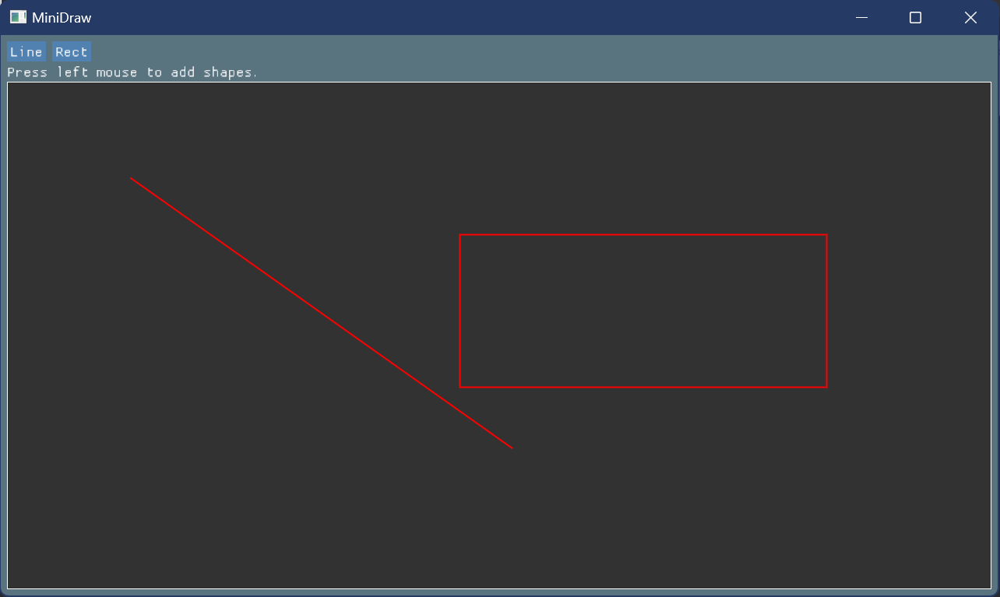
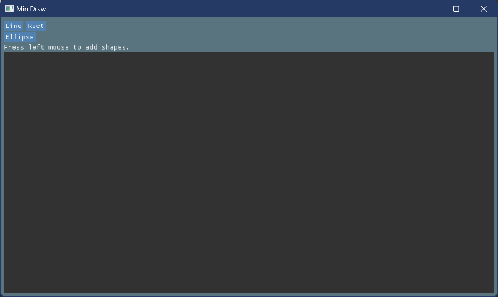
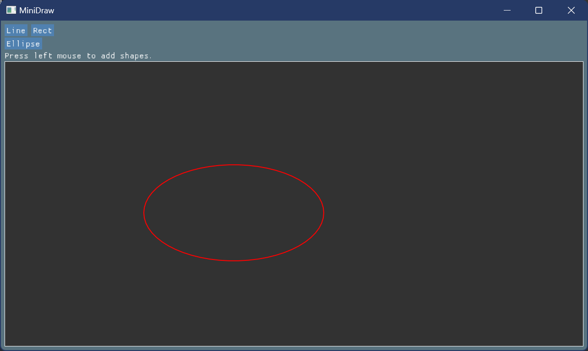
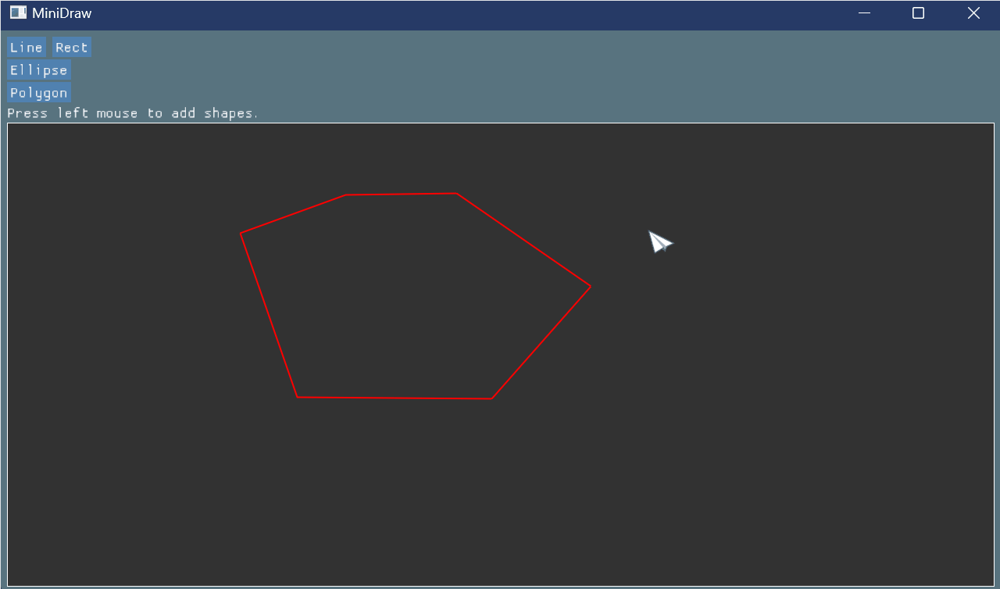
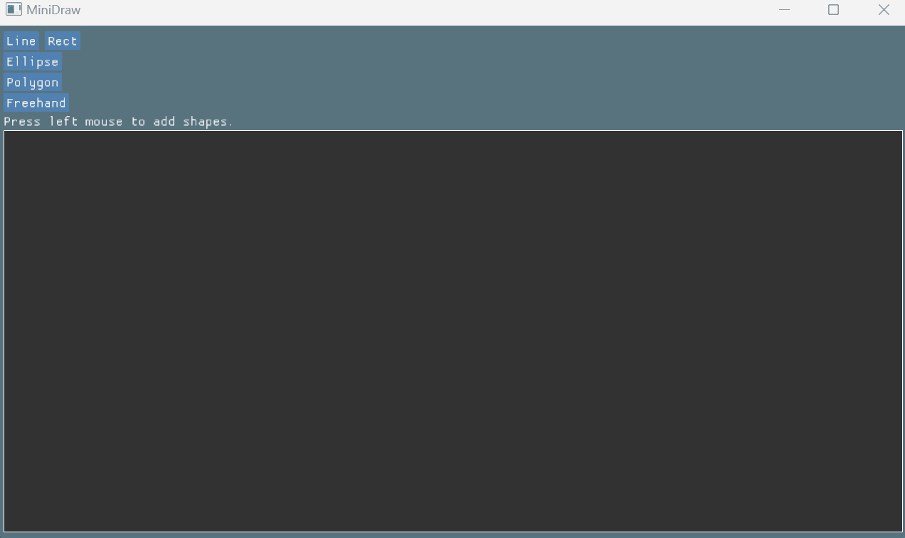

# MiniDraw 说明文档

## 学习过程

- 大致阅读 [GUI 简介](./supplement/gui_introduction.md)，不完全懂也没关系，不用担心！
- 根据 [配置说明](../../../Framework2D/README.md) 配置作业项目代码，把 Demo 程序跑通。
- 简单了解 [绘图基本功能的实现](./supplement/framework_details.md) ，一步一步完成画**直线**和**矩形**的 MiniDraw 程序，学习如何添加按钮、处理鼠标交互等。**（这一步的结果已经在框架中给出，目的主要是帮助了解框架的使用，你也可以运行 `1_MiniDraw.exe` 尝试，直接进入下一步完成 MiniDraw 功能的扩充。）**
- 模仿上述过程，添加更多图形的绘制，如 `Ellipse`，`Polygon`，`Freehand`（自由绘制模式，optional）等。我们在程序中提供了若干处 `HW1_TODO` 的提示，根据本文档接下来的教程补充相应的功能，就可以完成这次作业。

## 目标和要求

- 在 [Canvas 类](../../../Framework2D/src/assignments/1_MiniDraw/canvas_widget.h) 和 [Shapes 文件夹](../../../Framework2D/src/assignments/1_MiniDraw/shapes/) 中添加绘制新图形 `Ellipse`, `Polygon`, `Freehand` 的功能；
- 在 [MiniDraw 窗口类](../../../Framework2D/src/assignments/1_MiniDraw/minidraw_window.h) 中添加相应的交互按钮；
- 学习类的**继承**和**多态**；
- 选做：实现画图工具的各种拓展功能。
  
## 0. 配置框架

- 请确保已经按照 [框架配置说明](../../../Framework2D/README.md) 配置成功框架代码，这个时候应该可以运行成功 `1_MiniDraw` 项目，已经实现了 `Line` 和 `Rectangle` 的绘制；
- 善用 VS Code 的全局搜索功能，快捷键 `Ctrl+Shift+F`，例如你可以使用这个功能全局搜索 `HW1_TODO` 的提示，帮助快速定位到关键部分。
- **符合项目要求的结构设计、实现方法有很多，你不一定要严格按照下面的提示来实现，如果你有更好的想法，请务必实现它，并且在报告文件中详细描述。**

如果配置成功了，运行作业项目，可以出现如下的界面：
  
<div align=center></div align>


## 1. 添加椭圆绘制功能

### Step 1：在主窗口中添加一个 `Ellipse` 按钮交互

[minidraw_window.cpp](../../../Framework2D/src/assignments/1_MiniDraw/minidraw_window.cpp) 的 `draw_canvas()` 函数负责窗口中各种内容的绘制，在这里可以添加一个按钮，实现椭圆图形类型的切换。可以仿照前面直线段和矩形的按钮实现。

```cpp
// Buttons for shape types
// 绘制直线段的按钮
if (ImGui::Button("Line"))
{
    std::cout << "Set shape to Line" << std::endl;
    p_canvas_->set_line();
}
// 绘制矩形的按钮
ImGui::SameLine();
if (ImGui::Button("Rect"))
{
    std::cout << "Set shape to Rect" << std::endl;
    p_canvas_->set_rect();
}
// HW1_TODO: More primitives
//    - Ellipse
//    - Polygon
//    - Freehand(optional)
```

单击这个按钮的时候， `p_canvas` 需要执行 `set_ellipse()` 操作切换自己的图形类型。所以，你需要先在 [canvas_widget.h](../../../Framework2D/src/assignments/1_MiniDraw/canvas_widget.h) 为 `Canvas` 类添加一个 `set_ellipse()` 方法，
```cpp
// Shape type setters.
void set_default();
void set_line();
void set_rect();
// HW1_TODO: more shape types.
```
并在 [canvas_widget.cpp](../../../Framework2D/src/assignments/1_MiniDraw/canvas_widget.cpp) 中实现它，可以参考`set_line()`、`set_rect()`的实现。
这样就可以正确切换图形类型了。

<div align=center></div align>

不过这个时候我们还没有实现椭圆对应的数据结构和绘制方法，因此画不出椭圆。

### Step 2: 实现 ``Ellipse`` 图形类

在 [shapes/](../../../Framework2D/src/assignments/1_MiniDraw/shapes/) 文件夹下新建一个 `ellipse.h` 文件 和 `ellipse.cpp` 文件。他们将用来实现椭圆类 `Ellipse`。为了让项目读取到文件结构的更新，可以在 VS Code 中重新执行一次 CMake 配置。

椭圆类的实现请参考同文件夹下[直线类](../../../Framework2D/src/assignments/1_MiniDraw/shapes/line.h) `Line`、[矩形类](../../../Framework2D/src/assignments/1_MiniDraw/shapes/rect.h) `Rect` ，你需要为椭圆定义一个数据存储的结构 `Class Ellipse`，一个构造方法，并实现一个椭圆的绘制函数 `draw()`，这里 ImGui 为我们提供了一个现有的方法用以绘制椭圆：

```cpp
void AddEllipse(const ImVec2& center, const ImVec2& radius, ImU32 col, float rot, int num_segments, float thickness);
```

为了实现椭圆形状的动态更新，可以仿照 `Line` 和 `Rect` 类写一个 `update(float x, float y)` 函数，它用传入的二维鼠标位置更新椭圆内存储的数据。

> **思考：`Class Ellipse` 是如何体现类的封装和继承的。**

### Step 3: 在 `canvas_widget.cpp` 中实现鼠标绘制椭圆

现在我们已经实现了椭圆类，并且为 `Canvas` 添加了椭圆类型的绘制状态，下一步将在椭圆状态 `shape_type_ == kEllipse` 下实现鼠标绘制椭圆。实现了 [canvas_widget.cpp](../../../Framework2D/src/assignments/1_MiniDraw/canvas_widget.cpp) 中鼠标点击事件的 `HW1_TODO` 后，可以做到效果： “鼠标单击开始绘制椭圆，移动鼠标自动更新椭圆，再次单击鼠标结束绘制”：
- 在 `canvas_widget.cpp` 中包含椭圆头文件 `ellipse.h`；
- 在函数 `mouse_click_event()` 中用构造方法创建一个椭圆，让 `current_shape_` 指向它；
```cpp
if (!draw_status_) // 点击鼠标开启绘制状态
{
    draw_status_ = true;
    start_point_ = end_point_ = mouse_pos_in_canvas();
    switch (shape_type_) // 根据当前绘制类型为 current_shape_ 构造不同的绘制对象
    {
        case USTC_CG::Canvas::kDefault:
        {
            break;
        }
        // 构造直线段对象
        case USTC_CG::Canvas::kLine:
        {
            current_shape_ = std::make_shared<Line>(
                start_point_.x, start_point_.y, end_point_.x, end_point_.y);
            break;
        }
        // 构造矩形对象
        case USTC_CG::Canvas::kRect:
        {
            current_shape_ = std::make_shared<Rect>(
                start_point_.x, start_point_.y, end_point_.x, end_point_.y);
            break;
        }
        // HW1_TODO: case USTC_CG::Canvas::kEllipse:
        default: break;
    }
}
```

剩下的操作都是已经完成了的，不需要额外补充：
- 函数 `mouse_move_event()` 中调用 `update` 函数动态更新 `current_shape_`；
- 函数 `mouse_click_event()` 在绘画状态中单击时退出绘画状态，并存储当前图形。

至此，椭圆的绘制程序就完成了。

<div align=center></div align>

> **思考：`Class Ellipse` 是如何体现类的多态的。**

## 2. 添加多边形绘制功能

添加多边形绘制功能和前三个图形是类似的，不过交互上会稍有不同，同学们可以自己思考实现的方法，下面给出一种简单实现方案：

### Step 1: 在主窗口中添加一个 `Polygon` 按钮交互

### Step 2: 实现多边形图形类 `Class Polygon`

> **思考：多边形的数据应该如何存储？**

一个 Polygon 类的示例：
```cpp
class Polygon : public Shape
{
   public:
    Polygon();
    Polygon(std::vector<float> x_list, std::vector<float> y_list);
    virtual ~Polygon() = default;

    void draw(const Config& config) const;
    void update(float x, float y);
    void add_control_point(float x, float y);

   private:
    std::vector<float> x_list_, y_list_;
};
```

对于多边形，重写 `add_control_point(float x, float y)` 函数可以用于为其添加顶点，实现 `update(float x, float y)`以传递鼠标移动时的更新，绘制函数 `draw()` 可以将其**分解为多段直线绘制**。

> **在 ImGui 中也提供了多边形的绘制函数，但是它做不到在绘制的过程中保持开放，绘制结束时连接首位两点的效果**

### Step 3: 在 `canvas_widget.cpp` 中实现鼠标绘制多边形

可以按照这样的逻辑：**鼠标左键单击时**，创建一个多边形对象，**后续鼠标左键单击的时候**为多边形添加顶点，直到**鼠标右键单击**结束多边形的创建。

相应地要修改 `mouse_click_event()`, `mouse_move_event()`, `mouse_release_event()` 中的中多边形相关的逻辑，此外，你可以模仿上述函数，在 Canvas 中实现鼠标右键的逻辑 `mouse_right_click_event()`，例如：

```cpp
void Canvas::draw()
{
    draw_background();
    // HW1_TODO: more interaction events
    if (is_hovered_ && ImGui::IsMouseClicked(ImGuiMouseButton_Left))
        mouse_click_event();
    if (is_hovered_ && ImGui::IsMouseClicked(ImGuiMouseButton_Right))
        mouse_right_click_event(); // 这个函数需要自己添加和实现
    mouse_move_event();
    if (!ImGui::IsMouseDown(ImGuiMouseButton_Left))
        mouse_release_event();

    draw_shapes();
}
```
参考示例：
<div align=center></div align>

> **Freehand 图形的绘制事实上和多边形较为类似，实现思路是一致的。**

参考示例：
<div align=center></div align>

## 查看类图

作业要求导出实现的各种形状的类关系图，可以参考 [Visual Studio 导出类图](https://blog.csdn.net/songhuangong123/article/details/125970557) 或 [使用 plantuml 绘制类图](../../../Softwares/Clang-uml.md)。

## 补充材料和提示

### 补充材料
- [GUI 简介](./supplement/gui_introduction.md) 简要介绍了图形用户界面（GUI）以及其常用的开发工具，通过它你将对 GUI 开发以及我们接下来几次作业用到的 [Dear ImGui 库](https://github.com/ocornut/imgui) 有大致的了解。 
- [绘图基本功能的实现](./supplement/framework_details.md) 描述了作业框架中的文件是如何创建和编写的，以便同学们参考学习。

### 提示：如何学习 ImGui 编程？

ImGui 包含了详细的[使用文档](https://github.com/ocornut/imgui/wiki) 和 [讨论社区](https://github.com/ocornut/imgui/issues) 以及许多第三方网站的教程。各种功能（窗口、菜单、工具栏、多窗口、图像读写、鼠标响应……）都可以找到对应的方式去实现。

注意：学习 ImGui 的方法是先模仿着用好，经验多了就会了。不要像学习数学那样，把介绍 ImGui 的文档看完后才来做。而是先模仿，用到什么再去学什么。这是学编程和学数学很大不一样的地方。

对于一个特定的功能，比如加菜单，或画图，你只要先跟着程序框架中的范例或者 ImGui 的 Demo 教程模仿一遍，运行着试试看发生什么，以后模仿着做就会了。

完成这个任务，你只需：

- 阅读 ImGui 自带简单例子的源码；
- 了解如何产生一个窗口程序，如何加菜单，加按钮；
- 按照范例学会如何交互鼠标，如何利用画图；
- 完成作业。

（有些教程中有类似于这个作业的画图工具的示范，模仿者学会加强即可。其他部分可以暂时不学）

再次重申，没有必要完全搞清楚 ImGui 才能做该作业。你只要完全跟着 ImGui 的教程模仿几个基本操作的实现（窗口、菜单、按钮、鼠标响应即可），或参考 [绘图基本功能的实现](./supplement/framework_details.md) ，然后根据要求完成作业任务即可。

现在不要太深入的学习 ImGui 的功能！如果你过早去看 ImGui 的其他功能，你会觉得 ImGui 很难学。但事实上，没那么难。你觉得难只是你的方法有问题！就像学习游泳，你看书是永远学不会的，只有多下水多折腾，就慢慢体会，慢慢学会了。

记住：**学习=模仿+重复！**

### Qt 版本的 MiniDraw 实现

**注意本次作业没有使用 Qt，因此无需下载和配置 Qt 相关环境。**

可以参考 [2020年图形学 MiniDraw](https://github.com/Ubpa/USTC_CG/tree/master/Homeworks/1_MiniDraw/documents) 的说明文档，其中包含了 GUI 开发工具 Qt 的详细介绍，以及使用 Qt 开发 MiniDraw 应用的教程和[示例](https://pan.baidu.com/s/1o8nXdwA)。感兴趣的同学可以通过其中的资料自行了解 Qt 的使用，比较 Qt 和本次作业框架的异同。